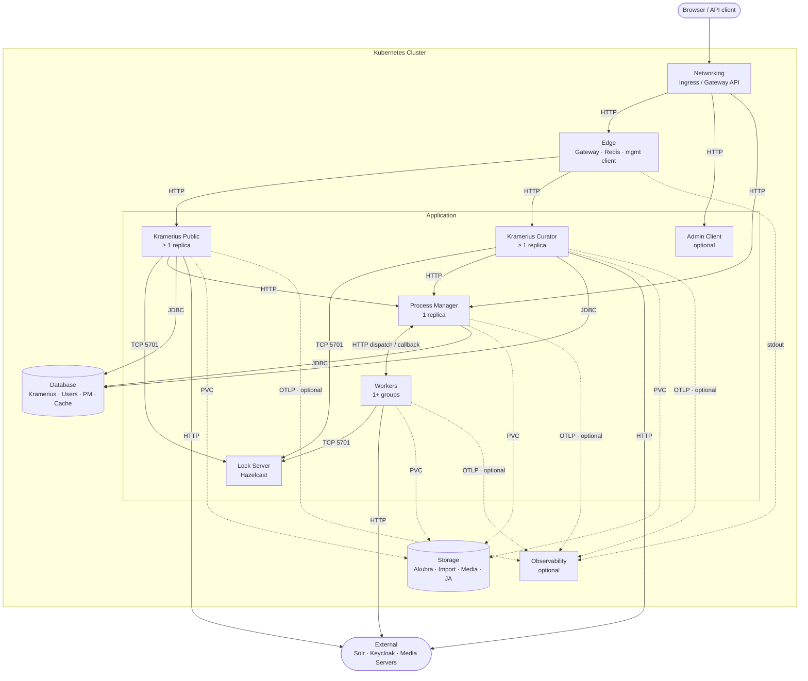
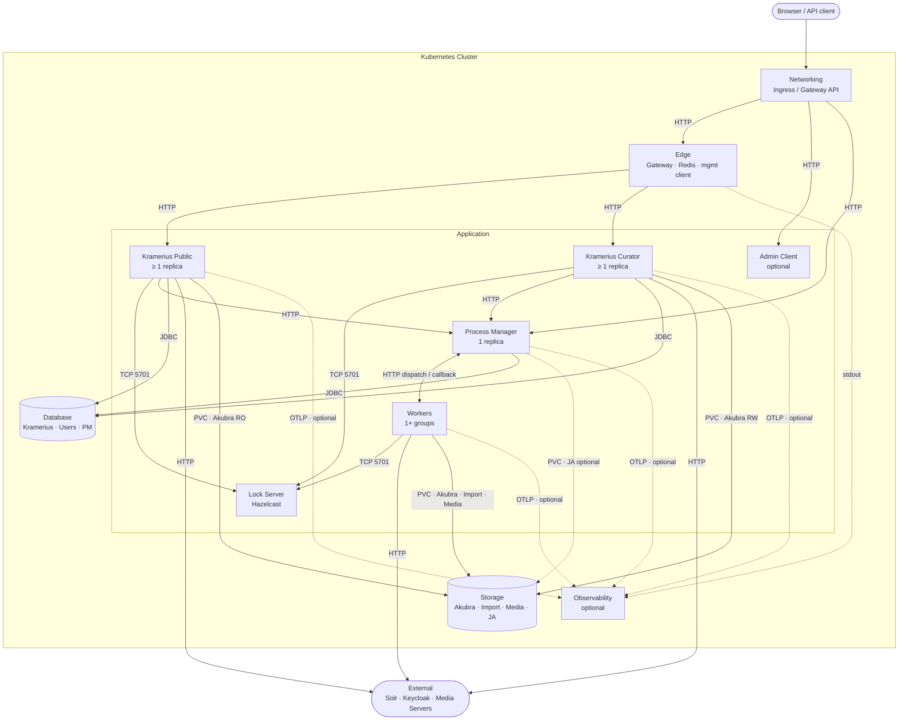
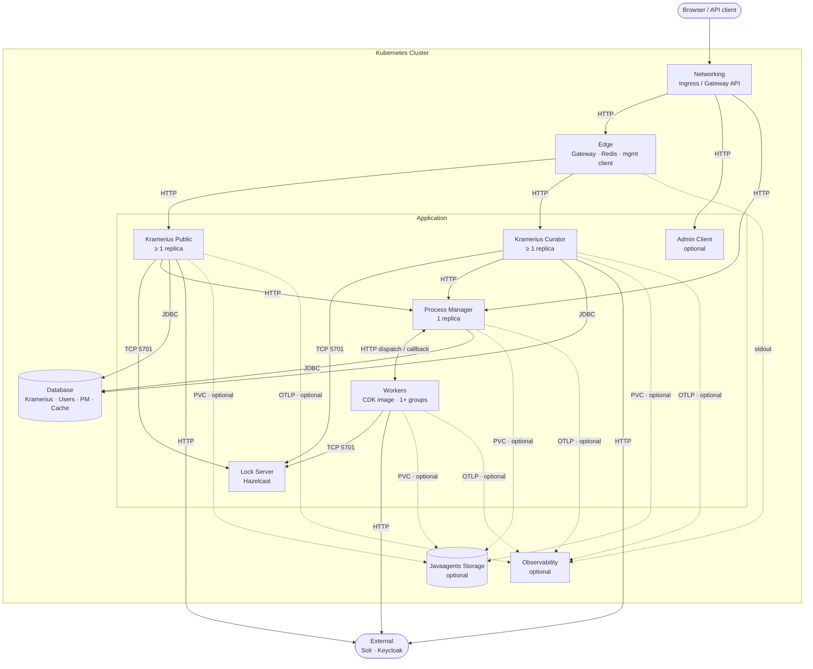
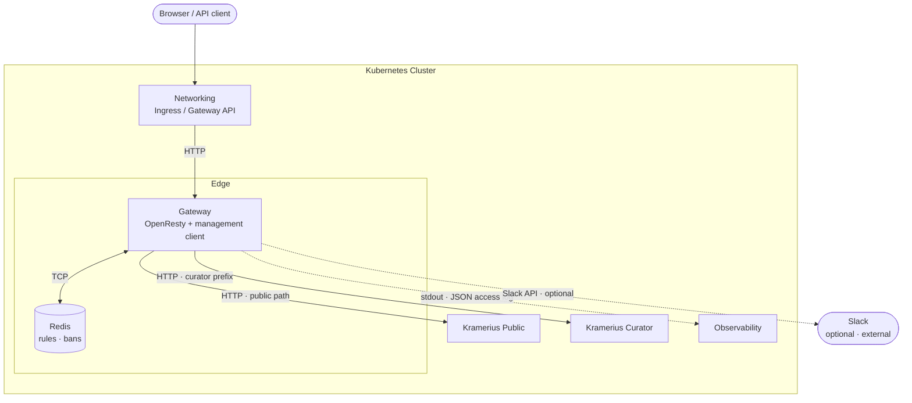
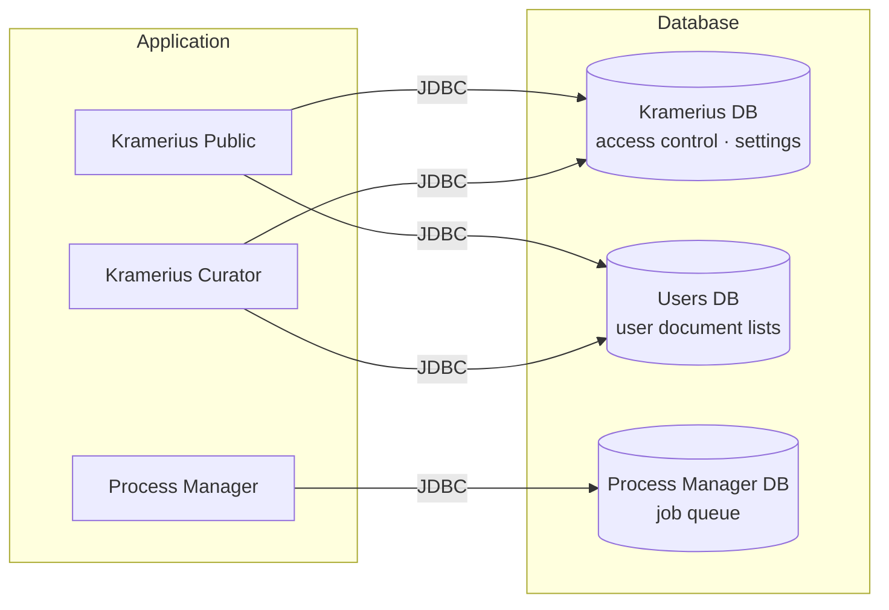
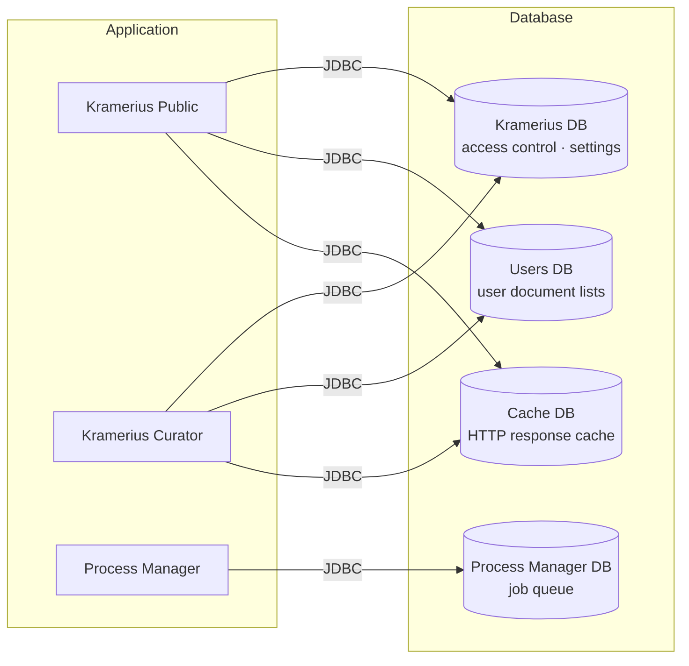
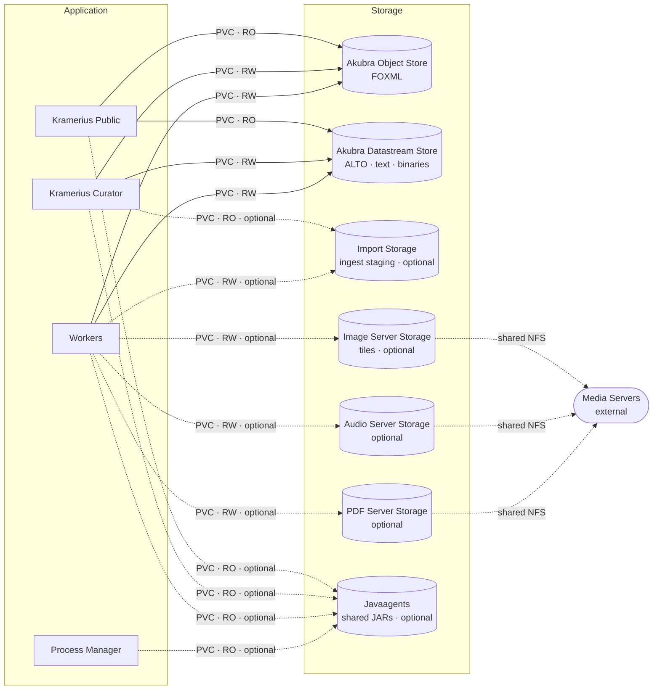
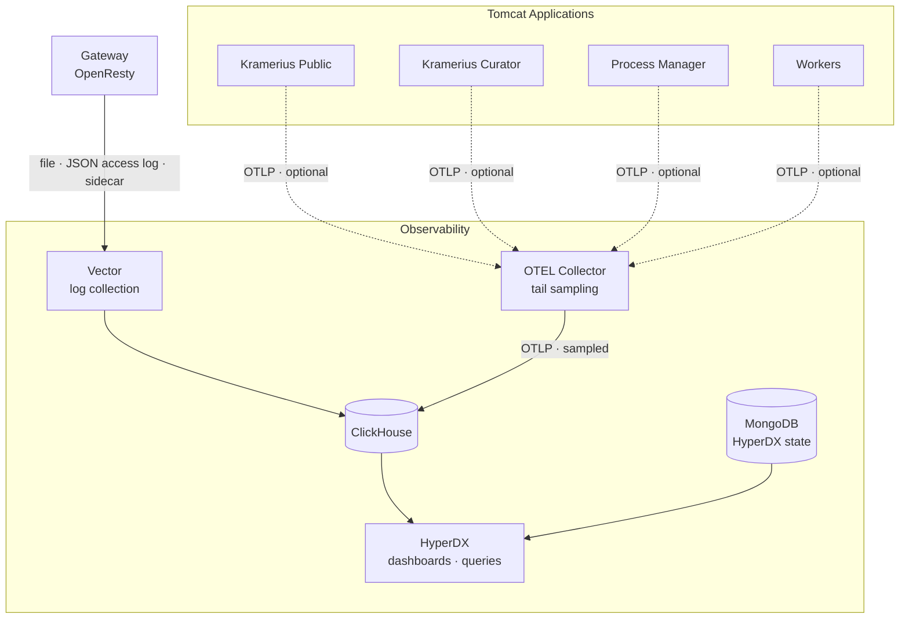
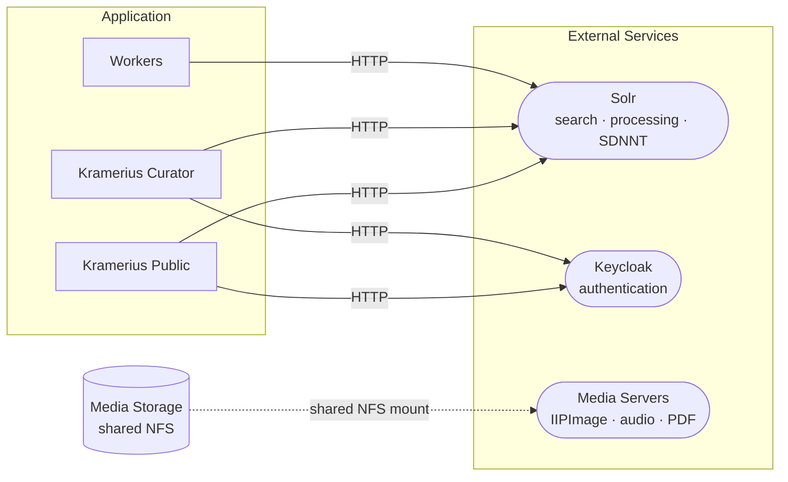
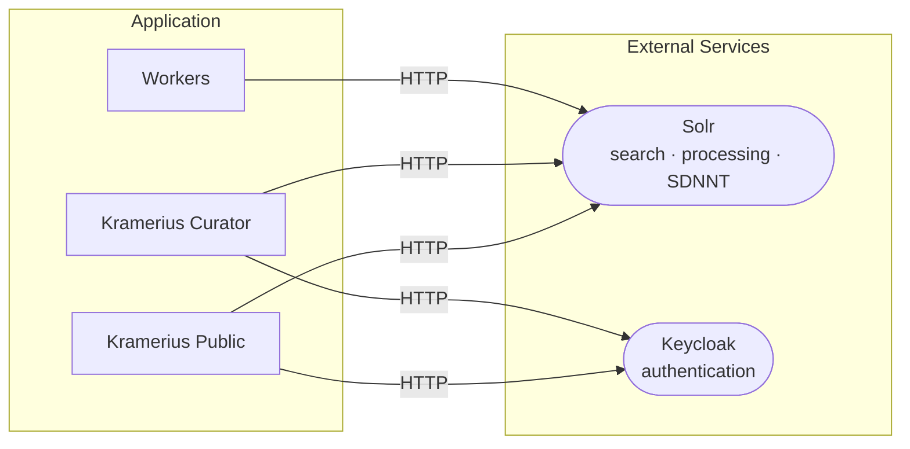

# Platform Architecture

Runtime components of the Kramerius 7 platform, their roles, communication paths, and the constraints that govern what must be deployed together.

---

## 1. Component Catalog

| Component | Required | Role |
|---|---|---|
| **Networking** | Yes | Kubernetes Ingress or Gateway API (mutually exclusive); external exposure for Gateway, Admin Client, and Process Manager |
| **Gateway** | Yes | Single HTTP entry point; OpenResty + management client; routes traffic, enforces rate limits and download quotas, manages bans; runtime state (rules, bans) persisted in Redis; management client is a Bottle web application with HTML dashboard for configuring rates and bans, with optional Slack integration for ban/unban and limit inspection directly from Slack |
| **Admin Client** | Optional | Stateless nginx SPA for library administrators; all backend calls originate from the browser, no server-side logic |
| **Kramerius Public** | Yes | Read-only application; serves the public search API, document metadata (FOXML, DC, MODS), full and thumbnail images (IIIF or other approaches), public job submissions (e.g. PDF generation); scales horizontally |
| **Kramerius Curator** | Yes | Read-write application for content administration; FOXML editing, datastream management, batch job submission; concurrent-safe via lock server; scales horizontally |
| **Process Manager** | Yes | Central task scheduler; receives job submissions from Public and Curator, dispatches work to workers, persists queue; single replica only |
| **Workers** | Yes | Background task execution in one or more independently scalable StatefulSet groups; communicate with Process Manager only |
| **Lock Server (Hazelcast)** | Yes | In-memory distributed lock service; coordinates concurrent writes across Curator and Worker replicas; single replica |
| **Kramerius DB** | Yes | Core application database — access control, settings, application state; used by Public and Curator |
| **Users DB** | Yes | User-defined document lists (folders); JDBC URL wired to Public, Curator, and Workers via shared `configuration.properties` |
| **Process Manager DB** | Yes | Job queue and execution log; used exclusively by Process Manager |
| **Cache DB** | CDK only | HTTP response cache keyed by URL, source library, PID, and user identity; used by Public and Curator |
| **Akubra Object Store** | Standard only | FOXML object storage (NFS/PVC); read-only for Public, read-write for Curator and Workers |
| **Akubra Datastream Store** | Standard only | Binary datastream storage — ALTO, text, etc. (NFS/PVC); same access pattern as object store |
| **Import Storage** | Optional | Ingest staging volumes (NFS/PVC); read-write for Workers, read-only for Curator |
| **Media Storage** | Optional | Three independent volumes (`storages.imageserver`, `storages.audioserver`, `storages.pdfserver`) for image tiles, audio, and PDF derivatives (NFS); Workers write, external media servers read from the same NFS shares |
| **Javaagents Storage** | Optional | Shared read-only PVC with JAR files; required when any Tomcat component enables a javaagent (e.g. OTEL agent) |
| **Observability** | Optional | Vector + OTEL Collector + ClickHouse + HyperDX + MongoDB (HyperDX state); Vector collects Gateway JSON access logs (with optional GeoIP enrichment via init Job + updater CronJob); Tomcat components with OTEL enabled send traces to the OTEL Collector, which applies tail sampling before forwarding to ClickHouse |
| **Solr** *(external)* | Yes | Full-text search, processing index, SDNNT sync, structured logs, monitoring endpoint |
| **Keycloak** *(external)* | Yes | Authentication and token issuance for all application components |
| **Media Servers** *(external)* | Optional | IIPImage/Cantaloupe, audio server, PDF service; mount the same NFS share as Media Storage |

### Architecture Overview

All possible components across both deployment configurations. The Application tier is expanded; Edge, Database, Storage, Observability, and External are collapsed to group nodes. See [Section 4](#4-component-group-details) for per-group detail diagrams.

---

## 2. Standard Deployment

The standard deployment is the full Kramerius stack with local object storage. Default for library deployments managing their own digitized content.

**What is active:** all required components, Akubra object and datastream stores, Import and Media Storage (both optional), no Cache DB.

---

## 3. CDK Deployment

The CDK deployment omits local Akubra storage (digital objects are managed externally) and adds a Cache DB for HTTP response caching. Workers use a CDK-specific container image.

**What differs from standard:** no Akubra stores, no Import Storage, no Media Storage, Cache DB present, CDK worker image.

---

## 4. Component Group Details

### 4.1 Edge

The Gateway is the single HTTP entry point for the cluster. OpenResty (nginx + LuaJIT) routes requests based on the curator path prefix: requests matching the prefix go to the Kramerius Curator backend; all other requests go to Kramerius Public. Rate limits, download quotas, and ban rules are persisted in Redis.

The management client is a separate Deployment alongside the Gateway. Its HTTP server exposes an API for configuring rate limits and bans at runtime. Optionally it connects to Slack, enabling operators to ban/unban clients, inspect active bans, and query current limits directly from a Slack workspace without accessing the HTTP API directly.

Authentication for internal services (process-manager, gateway-management-client, hyperdx) is handled at the Ingress/Gateway API layer via annotations — add auth-url/auth-signin or equivalent annotations directly in each backend's `annotations` map.

### 4.2 Database

Each database role is an independent PostgreSQL instance (CNPG cluster or deployable PG subchart). Roles do not share a server or cluster. Values key mapping: Kramerius DB → `databases.kramerius`, Users DB → `databases.users`, Process Manager DB → `databases.process`, Cache DB → `databases.cache`.

#### Standard

#### CDK

Adds Cache DB used by Public and Curator for HTTP response caching (keyed by URL, source library, PID, and user identity).

### 4.3 Storage

CDK deployments carry Javaagents Storage only — no Akubra, Import, or Media. The detail below covers the Standard profile. In CDK all four Tomcat components (Public, Curator, PM, Workers) optionally mount the Javaagents PVC read-only.

### 4.4 Observability

Vector runs as a sidecar container in the Gateway pod, collecting JSON access logs via a shared file volume (`/var/log/nginx/access.log`). Tomcat applications (Public, Curator, Process Manager, Workers) send distributed traces to the OTEL Collector via OTLP when the OTEL javaagent is enabled. The OTEL Collector applies tail sampling before writing to ClickHouse: all traces containing at least one error span are kept; a configurable percentage of fully-successful traces is sampled. HyperDX provides dashboards and queries against ClickHouse. This detail diagram is identical for Standard and CDK.

### 4.5 External

#### Standard

Solr is used by Public, Curator, and Workers for full-text search, processing index, and SDNNT sync. Keycloak provides authentication for Public and Curator. External Media Servers (IIPImage/Cantaloupe, audio, PDF service) share an NFS mount with Media Storage — Workers write derivative files, Media Servers serve them.

#### CDK

No Media Storage or external Media Servers in CDK. Solr and Keycloak usage is identical to Standard.

---

## 5. Dependency Rules

Rules that govern which optional components must be present when other components or features are enabled.

### Workers

- Workers always require **Process Manager** (job dispatch and callback registration).
- Workers always require **Lock Server** (distributed lock acquisition before write operations).
- Workers require **Akubra Object Store** and **Akubra Datastream Store** when running process types that read or write digital objects (standard deployment only; absent in CDK).
- Workers require **Import Storage** when running ingestion process types (standard deployment only; CDK workers do not use import storage). Import Storage must be configured before any ingest worker group is started.
- Workers require **Media Storage** (the relevant volumes) when running derivative generation process types — image tiles, audio, PDF (standard deployment only; CDK workers do not use media storage). The same NFS share must be mounted by the corresponding external media server.

### Kramerius Curator

- Curator requires **Lock Server** at all times — it acquires distributed locks before every content mutation regardless of replica count.
- Curator requires **Akubra Object Store** and **Akubra Datastream Store** in standard deployments (read-write mounts).
- Curator optionally mounts **Import Storage** read-only for ingest inspection; if Import Storage is configured, Curator will mount it automatically.

### Kramerius Public

- Public requires **Akubra Object Store** and **Akubra Datastream Store** in standard deployments (read-only mounts).
- The chart wires **Users DB** JDBC URL to Public, Curator, and Workers via the shared `configuration.properties` database section. Whether Curator and Workers actively query it is an application-level concern.

### Javaagents Storage

- **Javaagents Storage** must be provisioned whenever any Tomcat component enables a javaagent. The following components support independent per-component javaagent configuration: Kramerius Public, Kramerius Curator, Process Manager, and each Worker group.
- The relevant JAR file must be present in the PVC before the component starts. The chart wires the `-javaagent` JVM flag automatically once enabled.
- OTEL distributed tracing is one specific javaagent use case; other agents (APM, profilers) follow the same pattern and the same prerequisite.

### Observability

- The observability stack (Vector + OTEL Collector + ClickHouse + HyperDX) collects two data streams:
  - **Gateway JSON access logs** via stdout → Vector → ClickHouse (always active when observability is deployed).
  - **OTEL traces** from Tomcat components (Public, Curator, Process Manager, Workers) that have the OTEL javaagent enabled; spans are sent via OTLP to the **OTEL Collector**, which applies tail sampling before forwarding to ClickHouse.
- The OTEL Collector tail sampling policy: **always keep** traces that contain at least one error span; **sample a configurable percentage** of fully successful traces. This ensures complete visibility into failures without storing every successful request.
- When OTEL tracing is enabled for any component, **Javaagents Storage** must be provisioned and the OTEL JAR must be present in it.

### Admin Client

- Admin Client requires **Networking** to be reachable externally. It has no runtime pod-level dependencies — all API calls are made from the end user's browser directly to Kramerius Public, Curator, and Keycloak.

### Networking

- Exactly one of Ingress or Gateway API must be enabled. Enabling both simultaneously causes a Helm template error.

### Gateway

- Gateway requires **Kramerius Public** and **Kramerius Curator** as upstream targets. Both services must exist before the gateway can proxy requests.
- Gateway's **Redis PVC** (`gateway-redis-data`) is always created by the chart. Runtime configuration (rules, peak hours, bans) is stored in Redis and managed via the management client after deployment.

### Database

- Each database role (**Kramerius DB**, **Users DB**, **Process Manager DB**, **Cache DB**) is an independent PostgreSQL instance — they do not share a cluster.
- **Cache DB** is only required in CDK deployments.
- In CNPG mode the CNPG operator must be installed in the cluster before applying the chart.
