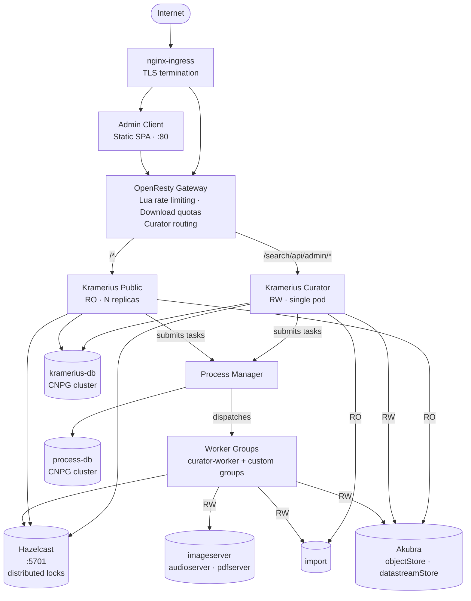
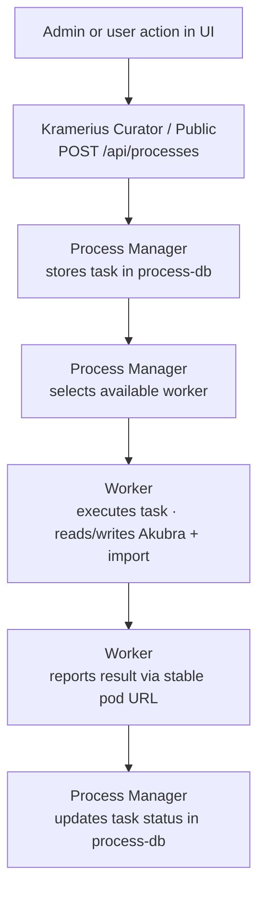

# Kramerius 7 — Helm Deployment

This chart deploys **Kramerius 7**, a digital library platform used for managing and serving digitized documents. The chart targets a Kubernetes cluster with the CloudNative-PG operator installed.

## Components

| Component | Kind | Purpose |
|---|---|---|
| [Gateway (OpenResty)](docs/gateway.md) | Deployment | Edge proxy — rate limiting, download quotas, routing |
| [Kramerius Public](docs/kramerius-public.md) | StatefulSet | Read-only API and search, horizontally scalable |
| [Kramerius Curator](docs/kramerius-curator.md) | StatefulSet | Read-write API for administrators, single instance |
| [Process Manager](docs/process-manager.md) | StatefulSet | Task scheduler — distributes work to workers |
| [Workers](docs/workers.md) | StatefulSet (per group) | Asynchronous task execution (import, indexing, etc.) |
| [Hazelcast](docs/hazelcast.md) | StatefulSet | Distributed lock server used by Kramerius and workers |
| [CNPG (PostgreSQL)](docs/cnpg.md) | CNPG Cluster | Two managed PostgreSQL databases |
| [Data Stores](docs/data-stores.md) | PVC / NFS | Shared FOXML object storage (Akubra), import store and media stores |
| [Admin Client](docs/admin-client.md) | Deployment | Static web UI for administration |

## Architecture Overview



## Request Flow

1. **Client & Admin Client → nginx-ingress** — TLS termination, SNI-based routing to correct service.
2. **nginx-ingress → OpenResty Gateway** — All Kramerius traffic passes through the gateway. Lua scripts enforce per-IP rate limits and download quotas. The gateway inspects the request path and routes:
   - `/search/api/admin/*` → **kramerius-curator**
   - everything else → **kramerius-public**
3. **Kramerius Public/Curator & Workers → Hazelcast** — Acquire distributed locks via Hazelcast before writing or indexing to avoid race conditions.
4. **Kramerius Curator → Import storage** — Curator reads the list of import packages from shared filesystem for presenting them to administrators.
5. **Kramerius Curator / Public → Process Manager** — Long-running operations (re-indexing, imports, licenses change) are submitted as tasks to the Process Manager REST API. Both the curator and the public instance can submit tasks.
6. **Process Manager → Workers** — The manager dispatches task execution to registered worker pods. Workers register themselves with a stable in-cluster DNS name (`POD_NAME.worker-NAME.NAMESPACE.svc.cluster.local`).
7. **Workers → Akubra storage** — Workers read and write FOXML objects and datastreams directly on the shared filesystem.
8. **Workers → Import storage** — Workers read imports from shared filesystem and remove import packages after successful imports.
9. **Workers → Media storage** — Workers write media from import packages into the shared filesystem.
10. **Kramerius Public/Curator & Process Manager → CNPG PostgreSQL** — Application state (RBAC, user data, task queues) is persisted in the two managed PostgreSQL clusters.
11. **Kramerius Public/Curator → Keycloak** — OIDC tokens issued by an external Keycloak instance are validated by the Kramerius Keycloak adapter on every authenticated request.

## Process / Task Flow



## Prerequisites

- Kubernetes 1.26+
- [CloudNative-PG operator](https://cloudnative-pg.io/) installed cluster-wide
- nginx ingress controller
- cert-manager (for TLS)
- Shared storage provisioner (NFS or a RWX-capable StorageClass)

## Quick Start

```bash
# Install / upgrade
helm upgrade --install kramerius ./helm/kramerius \
  --namespace kramerius --create-namespace \
  -f values.yaml

# Check status
kubectl -n kramerius get pods
```

## Values Reference

Key values to configure before deploying:

| Value | Description |
|---|---|
| `namespace` | Kubernetes namespace |
| `storages.defaultNfsServer` | Fallback NFS server for all volumes with `type: nfs` and no explicit `nfsServer` |
| `defaultStorageClass` | Default StorageClass used for PVC-backed volumes when `storageClass` is empty |
| `storages.*` | PVC / NFS configuration for data volumes (Akubra stores, import, media servers, javaagents) |
| `krameriusPublic.tomcatLogs` / `krameriusCurator.tomcatLogs` / `processManager.tomcatLogs` / `workerTomcatLogs` | Tomcat logs PVC/NFS per component (each StatefulSet creates its own claims) |
| `cnpg.processManager.password` / `cnpg.kramerius.password` | DB bootstrap credentials (used as `jdbcUserPass` in `configuration.properties` and to create the bootstrap Secret) |
| `akubraConfig` / `solrConfig` | Shared `configuration.properties` roots: Akubra patterns + Solr endpoints. The chart adds fixed Akubra mount paths, Keycloak (`auth.keycloak`), and the lock-server address. |
| `krameriusPublic.config.configurationPropertiesExtra` / `krameriusCurator.config.configurationPropertiesExtra` / `processManager.config.configurationPropertiesExtra` / `workerGroups[].config.configurationPropertiesExtra` | Freeform `configuration.properties` tail appended after the chart-generated JDBC section. Put JDBC pool tuning keys here (for example `jdbcMaximumPoolSize`, `jdbcLeakDetectionThreshold`, `jdbcConnectionTimeout`). |
| `auth.keycloak` | Keycloak adapter fields; rendered to `keycloak.json` and to Keycloak Java properties in `configuration.properties` |
| `gateway.rateLimits` | Per-IP request rate limits |
| `gateway.downloadLimits` | Per-IP download quota |
| `ingress.host` / `ingress.admin.host` / `ingress.processManager.host` | Hostnames for each exposed service |

See `helm/kramerius/values.yaml` for full annotated defaults.
