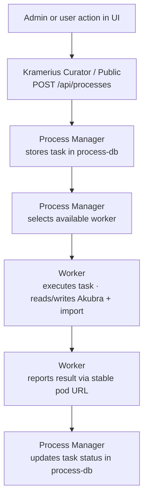

# Kramerius 7 Helm Chart

Helm chart for deploying Kramerius 7 on Kubernetes.

## Components

| Area | Documentation |
|---|---|
| Edge Gateway (+ Redis) | [`templates/gateway/README.md`](templates/gateway/README.md) |
| Networking (Ingress / Gateway API) | [`templates/networking/README.md`](templates/networking/README.md) |
| Admin Client | [`templates/admin-client/README.md`](templates/admin-client/README.md) |
| Kramerius Public | [`templates/kramerius-public/README.md`](templates/kramerius-public/README.md) |
| Kramerius Curator | [`templates/kramerius-curator/README.md`](templates/kramerius-curator/README.md) |
| Process Manager | [`templates/process-manager/README.md`](templates/process-manager/README.md) |
| Workers | [`templates/workers/README.md`](templates/workers/README.md) |
| Lock Server (Hazelcast) | [`templates/lock-server/README.md`](templates/lock-server/README.md) |
| Database | [`templates/database/README.md`](templates/database/README.md) |
| Storage: Akubra | [`templates/storage-akubra/README.md`](templates/storage-akubra/README.md) |
| Storage: Import | [`templates/storage-import/README.md`](templates/storage-import/README.md) |
| Storage: Media | [`templates/storage-media/README.md`](templates/storage-media/README.md) |
| CDK Configuration | [`templates/cdk/README.md`](templates/cdk/README.md) |
| Keycloak Integration | [`templates/keycloak/README.md`](templates/keycloak/README.md) |
| Solr / Index | [`templates/index-solr/README.md`](templates/index-solr/README.md) |
| Observability | [`templates/observability/README.md`](templates/observability/README.md) |

## Architecture

- Runtime/component architecture: [`PLATFORM_ARCHITECTURE.md`](PLATFORM_ARCHITECTURE.md)
- Chart/template architecture: [`HELM_ARCHITECTURE.md`](HELM_ARCHITECTURE.md)

## Request Flow

1. **Client & Admin Client -> ingress/gateway** - TLS termination and host-based routing to the correct service.
2. **Ingress/Gateway -> OpenResty Gateway** - All HTTP traffic passes through gateway rate-limit and quota policies.
3. **Gateway routing split**:
   - Curator path prefix (`/search/api/admin/*` by default) -> **kramerius-curator**
   - All other paths -> **kramerius-public**
4. **Public/Curator/Workers -> Hazelcast** - distributed locks protect write/index operations.
5. **Curator -> Import storage** - curator reads available import packages.
6. **Curator/Public -> Process Manager** - long-running actions are submitted as tasks.
7. **Process Manager -> Workers** - manager dispatches tasks to worker pods.
8. **Workers -> Akubra storage** - workers read/write object and datastream stores.
9. **Workers -> Import storage** - workers consume import inputs.
10. **Workers -> Media storage** - workers generate/write derivatives.
11. **Public/Curator/Process Manager -> PostgreSQL + Keycloak** - app state is stored in DB and authentication is validated against Keycloak.

Detailed runtime architecture: [`PLATFORM_ARCHITECTURE.md`](PLATFORM_ARCHITECTURE.md)

## Process / Task Flow



More details: [`PLATFORM_ARCHITECTURE.md`](PLATFORM_ARCHITECTURE.md)

## Prerequisites

- Kubernetes and operator/controller prerequisites: [`PLATFORM_ARCHITECTURE.md`](PLATFORM_ARCHITECTURE.md)
- Feature-specific prerequisites: component docs under [`templates/`](templates/)

## Deployment

Base values and profile overlays:

- [`values.yaml`](values.yaml)
- [`values.standard.yaml`](values.standard.yaml)
- [`values.cdk.yaml`](values.cdk.yaml)
- [`values.minimal.yaml`](values.minimal.yaml)
- [`values.maximal.yaml`](values.maximal.yaml)

Example:

```bash
helm upgrade --install kramerius . \
  --namespace kramerius --create-namespace \
  -f values.yaml \
  -f values.standard.yaml
```

Kustomize with Helm chart:

```yaml
apiVersion: kustomize.config.k8s.io/v1beta1
kind: Kustomization

helmCharts:
  - name: kramerius
    repo: https://rrandiak.github.io/kramerius-helm-chart
    releaseName: kramerius
    namespace: kramerius
    version: 1.0.0
    valuesFile: values.yaml
```

Apply:

```bash
kubectl apply -k .
```

## Values Reference

- Global defaults: [`values.yaml`](values.yaml)
- Profile overlays: [`values.standard.yaml`](values.standard.yaml), [`values.cdk.yaml`](values.cdk.yaml), [`values.minimal.yaml`](values.minimal.yaml), [`values.maximal.yaml`](values.maximal.yaml)
- Feature-level value contracts: files under [`templates/`](templates/) matching `values.part*.yaml`
- Feature behavior/details: component docs under [`templates/`](templates/)

## Development / Local

- [`dev/README.md`](dev/README.md)
- [`files/gateway/README.md`](files/gateway/README.md)
