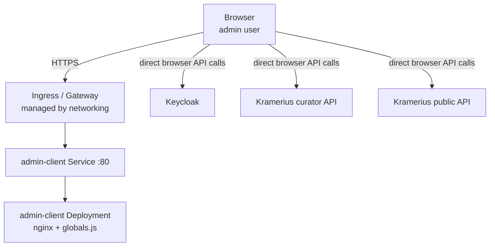

# Admin Client

Static single-page application (SPA) served by nginx. Provides the web UI for
library administrators. All API calls are made from the browser — there is no
server-side logic in the admin-client pod itself. The pod is effectively a
static file server with a thin runtime-config injection layer.

The admin UI communicates directly with the Kramerius curator API, the public
API, and the Keycloak identity provider. Because all communication is
browser-side, the pod needs no credentials or network access to backend
services; only the Ingress and DNS configuration matter at runtime.

## Position in the Stack



The admin-client pod is only in the path for the initial HTML/JS/CSS asset
delivery. After the browser loads the SPA, all further traffic bypasses the
pod entirely.

## Kubernetes Resources

| Resource | Name | Notes |
|---|---|---|
| Deployment | `admin-client` | Replica count configurable via `adminClient.replicas` |
| Service | `admin-client` | ClusterIP, port 80 |
| ConfigMap | `admin-client-globals` | Contains `globals.js` injected into the nginx document root |

## PVCs / Volumes

| Mount path in pod | Volume source | Access mode | Purpose |
|---|---|---|---|
| `/usr/share/nginx/html/assets/shared/globals.js` | ConfigMap `admin-client-globals` (key `globals.js`) | ReadOnly | Runtime JS configuration (API base URLs, Keycloak config) |

No PersistentVolumeClaims are used. The pod is fully stateless.

## Configuration

### globals.js

The file `/usr/share/nginx/html/assets/shared/globals.js` is generated from
`adminClient.config.*` values and mounted from ConfigMap `admin-client-globals`.
The SPA reads this object at startup to configure base URLs, login behavior,
dashboard cards, and dev mode flags.

A typical generated object looks like:

```js
var APP_GLOBAL = {
  coreBaseUrl: "https://k7.example.com",
  userClientBaseUrl: "digitalniknihovna.cz/mzk",
  deployPath: "",
  keycloak: {
    loginType: "all"
  },
  homeDashboard: [
    { "type": "processes" },
    { "type": "indexing", "subtype": "object" }
  ],
  altoeditor: [
    { "name": "ALTO editor", "domain": "https://altoeditor.example.com" }
  ],
  devMode: false,
  myCustomKey: "injected-via-extraGlobals"
};
```

### Image

```yaml
adminClient:
  image:
    repository: registry.example.com/k7-admin
    tag: latest
    pullPolicy: Always
    pullSecret: <secret>
```

Tag should be pinned to a specific digest or semver in production.

### Replicas

```yaml
adminClient:
  replicas: 1
```

The deployment is stateless and can be scaled horizontally. One replica is
sufficient for most setups; scale up if serving a high-traffic admin audience
or for HA during rolling upgrades.

### Values Summary

| Key | Default | Description |
|---|---|---|
| `adminClient.enabled` | `true` | Whether to render admin-client resources |
| `adminClient.replicas` | `1` | Replica count |
| `adminClient.image.repository` | `registry.example.com/k7-admin` | Container image repository |
| `adminClient.image.tag` | `latest` | Image tag |
| `adminClient.image.pullPolicy` | `Always` | Image pull policy |
| `adminClient.image.pullSecret` | `<secret>` | Optional image pull secret name for the admin-client image |
| `adminClient.resources.requests.cpu` | `10m` | CPU request |
| `adminClient.resources.requests.memory` | `32Mi` | Memory request |
| `adminClient.resources.limits.cpu` | `50m` | CPU limit |
| `adminClient.resources.limits.memory` | `64Mi` | Memory limit |
| `adminClient.config.userClientBaseUrl` | `digitalniknihovna.cz/mzk` | Public user-facing client URL shown/used by the SPA |
| `adminClient.config.keycloakLoginType` | `all` | Login flow mode consumed by SPA keycloak config |
| `adminClient.config.devMode` | `false` | Enables SPA development behavior toggles |
| `adminClient.config.homeDashboard` | list of dashboard entries | Default dashboard composition (card `type`/`subtype`, optional `hidden`) |
| `adminClient.config.altoeditor` | `[]` | ALTO editor instances (list of objects with `name` and `domain`) |
| `adminClient.config.extraGlobals` | `{}` | Arbitrary key-value pairs injected into `APP_GLOBAL` (values are serialized as JSON) |

## Resource Requests / Limits

| | Request | Limit |
|---|---|---|
| CPU | `10m` | `50m` |
| Memory | `32Mi` | `64Mi` |

The footprint is low because nginx serves only static files. Memory usage is
dominated by the nginx worker process baseline. The CPU limit is intentionally
tight; a single worker is sufficient.

## Dependencies

| Component | Protocol | Purpose |
|---|---|---|
| `networking` (Ingress/Gateway API) | HTTP/HTTPS | Exposes the admin-client Service on a dedicated hostname |
| Kramerius curator API | HTTP (browser) | Admin data operations — no pod-level dependency |
| Kramerius public API | HTTP (browser) | Read access for admin views — no pod-level dependency |
| Keycloak | HTTPS (browser) | Authentication and token issuance — no pod-level dependency |

## Notes

- All API calls originate from the end-user's browser, not from the
  admin-client pod. The pod only needs to be reachable for asset delivery.
- Runtime behavior is driven by generated `APP_GLOBAL` in
  `/assets/shared/globals.js`, built from `adminClient.config.*` plus
  networking-derived base URLs.
- This feature renders only Deployment, Service, and ConfigMap; external
  exposure and hostnames come from the `networking` feature.
- Rolling updates are safe because there is no local state. Old and new
  replicas can coexist briefly.
- Changes to `adminClient.config.*` or admin networking inputs
  (`ingress.*` / `gatewayApi.*`) update generated `globals.js` and trigger
  an admin-client rollout via checksum annotation.
