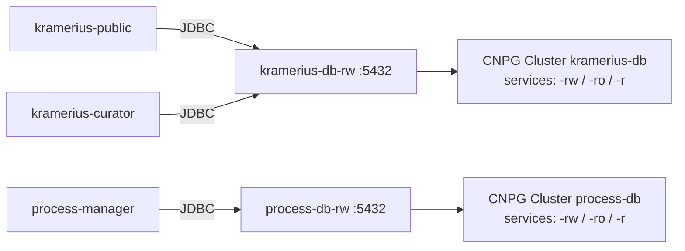

# Database

The database feature provisions and configures the PostgreSQL databases required by the Kramerius 7 application stack. The chart supports three deployment modes per role:

- **cnpg** — uses the CloudNativePG operator to manage fully-declarative PostgreSQL clusters inside Kubernetes
- **pg** — renders an in-chart PostgreSQL Deployment/Service/PVC for environments without the CNPG operator
- **external** — connects to a PostgreSQL instance running outside the cluster; no Kubernetes workload resources rendered for that role

The global `databases.mode` sets the default for all roles. Each role can override it independently with its own `mode:` field.

The target architecture defines up to four independent database roles: `kramerius` (core application data, used by Public and Curator), `process` (task queue and execution log for Process Manager), `users` (user-defined document lists), and `cache` (response cache for CDK mode). Each role has its own credentials, storage sizing, and independent lifecycle.

## Position in the Stack



## Kubernetes Resources

Resources rendered per role depend on its resolved mode. Each role is resolved independently before any resource is rendered.

### CNPG mode

| Resource | Name | Notes |
|---|---|---|
| `Cluster` (cnpg) | `<cluster.name>` | e.g. `kramerius-db`; configurable via `databases.<role>.cnpg.cluster.name` |
| `Secret` | `<cluster.name>-secret` | Bootstrap credentials (`kubernetes.io/basic-auth`); skipped if `existingSecret` set |
| Service (auto) | `<cluster.name>-rw` | Created by CNPG operator — read-write endpoint |
| Service (auto) | `<cluster.name>-ro` | Created by CNPG operator — read-only endpoint |
| Service (auto) | `<cluster.name>-r` | Created by CNPG operator — any replica endpoint |

### PG mode

| Resource | Name | Notes |
|---|---|---|
| `Deployment` | `<role>-pg` | One PostgreSQL pod per role |
| `Service` | `<role>-pg` | In-cluster endpoint |
| `Secret` | `<role>-pg-secret` | `kubernetes.io/basic-auth` credentials; skipped if `existingSecret` set |
| `PersistentVolumeClaim` | `<role>-pg-data` | Data volume from `databases.<role>.pg.storage.*` |

### External mode

No workload resources (Deployment, Service, PVC) are rendered. A credential Secret is still created unless `existingSecret` is set.

| Resource | Name | Notes |
|---|---|---|
| `Secret` | `<role>-pg-secret` | Credentials for secretKeyRef consumers; skipped if `existingSecret` set |

## Configuration

### Mode selection

Global mode applies to all roles by default. Override any role independently:

```yaml
databases:
  mode: cnpg       # global default

  kramerius:
    mode: ""       # empty = inherit global (cnpg)

  process:
    mode: external # this role connects to an external Postgres; no pod rendered
    external:
      host: pg.corp.example.com   # required when mode=external
      port: 5432
```

Valid values for `mode`: `cnpg`, `pg`, `external`. The chart fails at render time if `mode=external` and `external.host` is empty.

### JDBC URL

The chart always builds the JDBC URL. Host/port resolution per mode:

| Mode | Host | Port |
|---|---|---|
| `cnpg` | `<cluster.name>-rw` (e.g. `kramerius-db-rw`) | `5432` (hardcoded) |
| `pg` | `<role>-pg` or `databases.<role>.pg.host` if set | `databases.<role>.pg.port` (default `5432`) |
| `external` | `databases.<role>.external.host` | `databases.<role>.external.port` (default `5432`) |

### Credentials and existingSecret

The chart manages one `kubernetes.io/basic-auth` Secret per role (keys: `username`, `password`). When `existingSecret` is set for a role, the chart:

1. Skips creating its own Secret for that role.
2. Uses the provided name for all `secretKeyRef` consumers.

The external Secret must have `username` and `password` keys.

**Important for kramerius, users, and cache roles:** the database password is also embedded in `configuration.properties` (a ConfigMap) from `jdbc.password` in values at render time. `existingSecret` does not change this — `jdbc.password` must still be set correctly for these roles regardless of `existingSecret`.

For the `process` role (consumed only via `secretKeyRef` in process-manager), `jdbc.password` can be left as the placeholder when `existingSecret` is set.

### Example: CNPG + external mix

```yaml
databases:
  mode: cnpg

  kramerius:
    jdbc:
      database: kramerius
      username: kramerius
      password: strongpass
    cnpg:
      cluster:
        name: kramerius-db
        instances: 1
        maxConnections: ""
      storage:
        size: 10Gi
        storageClass: ""

  process:
    mode: external
    external:
      host: pg.corp.example.com
      port: 5432
    jdbc:
      database: process
      username: process
      password: strongpass
```

### Example: all roles in pg mode

```yaml
databases:
  mode: pg
  kramerius:
    pg:
      host: ""        # optional override; default service name is "kramerius-pg"
      port: 5432
      storage:
        size: 10Gi
        storageClass: ""
```

### Connection contract for application workloads

| Consumer | JDBC URL source | Credentials source |
|---|---|---|
| `kramerius-public` / `kramerius-curator` | `databases.kramerius.*` via helper | `databases.kramerius.jdbc.username/password` (also embedded in configuration.properties) |
| `process-manager` | `databases.process.*` via helper | `databases.process.jdbc.username/password` via secretKeyRef |

### Bootstrap Secret format (CNPG)

The chart creates one `kubernetes.io/basic-auth` Secret per CNPG cluster, consumed by CNPG's `initdb.secret` bootstrap mechanism:

```yaml
# Generated by the chart — do not apply manually
apiVersion: v1
kind: Secret
type: kubernetes.io/basic-auth
metadata:
  name: kramerius-db-secret
stringData:
  username: "kramerius"
  password: "<databases.kramerius.jdbc.password>"
```

### High-availability sizing (production)

For production deployments, set `instances: 2` (or more) on the `kramerius-db` cluster. The primary (`-rw`) handles all writes; CNPG promotes a standby on primary failure. `process-db` can typically stay at `instances: 1` since it holds transient task state.

```yaml
databases:
  kramerius:
    jdbc:
      password: "<strong-password>"
    cnpg:
      cluster:
        instances: 2
        maxConnections: "200"
      storage:
        size: 100Gi
        storageClass: ssd-retain
```

## PVCs / Volumes

CNPG manages PostgreSQL data PVCs automatically (named after cluster and pod index, not directly controlled by this chart).

PG mode creates one PVC per role named `<role>-pg-data`.

WAL archiving and backup PVCs are not part of this chart — configure those through CNPG's dedicated `backup` and `scheduledBackup` resources.

## Resource Requests / Limits

The CNPG operator applies default resource settings to each PostgreSQL cluster pod. This chart does not set resource requests/limits on CNPG-managed pods directly.

As a reference point, a production `kramerius-db` with moderate load typically needs:

| | Recommended minimum | Production recommendation |
|---|---|---|
| CPU | `250m` | `500m`–`1` |
| Memory | `512Mi` | `2Gi`–`4Gi` |

## Dependencies

| Component | How |
|---|---|
| CNPG operator | Must be installed in the cluster before applying CNPG mode resources. The `Cluster` CRD must exist. Only needed for roles with mode=cnpg. |
| `kramerius-public` | Connects to kramerius DB via JDBC |
| `kramerius-curator` | Connects to kramerius DB via JDBC |
| `process-manager` | Connects to process DB via JDBC |

## Notes

- `databases.<role>.cnpg.cluster.name` determines the prefix of all CNPG-generated Service names. Changing the cluster name after initial deployment creates a new cluster and leaves the old one behind — treat it as immutable after first deploy.
- Never commit database passwords to version control. Use Helm secrets plugins, external secret operators, or CI/CD secret injection.
- `cache` DB resources are rendered only when `cdk.enabled=true`.
- Database migrations are not run by the chart. Plan cutover using logical replication and the replace flow described in `HOW-TO-MIGRATE-DBS.md` (or your equivalent runbook).
