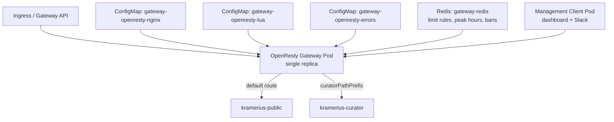

# Gateway

The gateway is the single entry point for all Kramerius HTTP traffic. It runs **OpenResty** (nginx + LuaJIT) and is responsible for request routing, access control enforcement (rate limits, download quotas), client identity resolution, and ban management.

The gateway runs as a **single replica**. Rate and download counters live in per-process Lua shared dicts (in-memory). **Redis** provides persistence for runtime configuration — limit rules, peak hours, and ban records — written there by the management client and picked up by the gateway automatically.

**Nothing about access control rules is configured through Helm values.** Rules (endpoint groups, user definitions, limits, peak hours, bans) are created and managed exclusively at runtime via the management client and API.

The **management client** is a Bottle app (module `management.py`) deployed alongside the gateway. It provides a browser dashboard and an optional **Slack slash command** handler at `POST /slack/commands`. Dependencies are installed on container startup (`pip install redis`). Runtime configuration is persisted to Redis.

### Access logs (ClickStack)

The gateway writes **JSON access logs to stdout** (`json_log` in `nginx.conf`). They are picked up by your cluster **ClickStack** pipeline (for example Vector → ClickHouse, with HyperDX or another UI for queries). This chart does **not** deploy Elasticsearch, Kibana, or Filebeat.

## Position in the Stack



## Kubernetes Resources

| Resource | Name | Notes |
|---|---|---|
| Deployment | `gateway-openresty` | Single replica |
| Service | `gateway-openresty` | ClusterIP, port 80 |
| ConfigMap | `gateway-openresty-nginx` | Full `nginx.conf` including resolver and shared dict declarations |
| ConfigMap | `gateway-openresty-lua` | All Lua scripts: routing, identity resolution, rule evaluation, ban logic |
| ConfigMap | `gateway-openresty-errors` | 429 response body template and line-delimited titles for random 429 responses |
| ConfigMap | `gateway-redis-config` | Redis `redis.conf` (RDB snapshots, optional `requirepass`) |
| PersistentVolumeClaim | `gateway-redis-data` | Redis RDB snapshot storage |
| Service | `gateway-redis` | ClusterIP port 6379 |
| Deployment | `gateway-redis` | Single replica Redis instance |
| Deployment | `gateway-management-client` | Single replica; Python web app and CLI for managing rules, limits, peak hours, bans |
| Service | `gateway-management-client` | ClusterIP; web UI accessible within the cluster |
| ConfigMap | `gateway-management-client-app` | `management.py`, `requirements.txt`, `endpoints.txt`, `dashboard.html`, `bottle.py`, `water.css` (mounted as `/app`) |

## PVCs / Volumes

| Mount path in pod | Volume | Access mode | Purpose |
|---|---|---|---|
| `/data` | `gateway-redis-data` PVC | ReadWriteOnce | Redis RDB snapshot |

Redis is the persistent store for all runtime gateway state. The gateway polls `gw:version` (a cheap INCR counter) every `pollIntervalSeconds` seconds and only fetches the full `gw:state` JSON blob when the version changes — no restart required. Rate and download counters and the user lookup cache are kept in Lua shared dicts (in-memory) and reset on pod restart — this is acceptable for a single-replica deployment.

## Configuration

### Routing

The gateway handles two kinds of routing:

**Public/curator routing (default server block)** — requests on the API host are matched by path prefix. Paths starting with `gateway.curatorPathPrefix` go to **kramerius-curator**; all other requests go to **kramerius-public**. Rate limiting and download quotas apply here.

```yaml
gateway:
  curatorPathPrefix: "/search/api/admin/"
  resolver: kube-dns.kube-system.svc.cluster.local valid=30s ipv6=off
```

**Virtual host routing** — process-manager, gateway-management-client, and hyperdx each receive traffic forwarded by the Ingress/Gateway API controller based on `Host` header. Authentication for these backends is configured via ingress controller annotations in the respective `ingress.*` or `gatewayApi.*` values — the gateway itself applies only rate limiting on the main API host.

### Response Caching

Gateway response caching is optional and configured through `gateway.caching.*`.
Caching decisions are made in OpenResty access phase (after limit checks), and
rules are matched by `pathTemplates` (same one-segment placeholder semantics
as other gateway path matching).

Supported cache backends:

- `proxy_cache` — nginx disk-backed cache (persistent only for pod lifetime)
- `lua_shared_dict` — in-memory cache in OpenResty shared dicts

#### How rule matching works

For each request:

1. Caching is skipped unless `gateway.caching.enabled=true`.
2. Request method must be in `gateway.caching.methods` (default `GET`, `HEAD`).
3. First matching rule by `pathTemplates` wins.
4. Backend behavior depends on `cacheType`:
   - `lua_shared_dict`: try memory hit; on miss, response may be stored in body filter.
   - `proxy_cache`: request is internally rerouted to generated `@gw_cache_*`
     location with nginx `proxy_cache`.

#### Key settings

| Key | Meaning |
|---|---|
| `gateway.caching.memory.maxEntryBytes` | Max body size stored in memory cache |
| `gateway.caching.memory.dictSize` | Body dict size for in-memory cache |
| `gateway.caching.memory.metaDictSize` | Metadata dict size (`hits`, timestamps) |
| `gateway.caching.proxyCache.inactive` | Nginx disk cache inactive retention |
| `gateway.caching.disk.emptyDirSizeLimit` | Pod disk budget for `proxy_cache` |
| `gateway.caching.rules[].minHits` | Minimum hits before storing response |
| `gateway.caching.rules[].ttl` | Cache TTL in seconds |
| `gateway.caching.rules[].cacheType` | `proxy_cache` or `lua_shared_dict` |

#### Example

```yaml
gateway:
  caching:
    enabled: true
    methods: [GET, HEAD]
    memory:
      dictSize: 64m
      metaDictSize: 8m
      maxEntryBytes: 2097152
    proxyCache:
      inactive: 7d
    disk:
      emptyDirSizeLimit: 8Gi
    rules:
      - pathTemplates:
          - "/search/api/{version}/search"
        cacheType: lua_shared_dict
        ttl: 60
        minHits: 2
      - pathTemplates:
          - "/search/img/{path}"
        cacheType: proxy_cache
        ttl: 86400
        minHits: 2
        keysZone: 32m
        maxSize: 2g
```

Notes:

- Cache key includes `method + host + full request URI` (including query string).
- `lua_shared_dict` is best for small hot responses; `proxy_cache` is better for
  larger/static responses.
- Cache entries are pod-local (single-replica by design for this gateway).

### Access Control Rules (managed via client)

Access control rules are **not part of the Helm deployment**. They are created and updated through the management client and stored in Redis. The gateway reads the current rule set from Redis on each poll tick.

A rule combines:
- **Name** — identifier used in management API calls and logs
- **Endpoint patterns** — 0 to N URL patterns; `*` matches exactly one path segment; empty means the rule applies to all endpoints
- **Users** — 0 to N named client definitions; empty means the rule applies to all clients
- **Rate limit** — optional; max requests per time window, with optional peak/off-peak values
- **Download limit** — optional; max bytes per time window, with optional peak/off-peak values

#### Rule Evaluation Order

For each request, the gateway resolves which rule and user entry apply:

1. **Endpoint matching** — endpoint patterns are evaluated from most specific to least specific:
   - Exact paths (no wildcards) first
   - Then by descending segment count
   - First matching pattern wins. A rule with no endpoints is a catch-all and matches any request.
2. **User matching within the matched rule** — evaluated in priority order:
   1. If a bearer token is present and `userResolution` is enabled: match by `username`
   2. Match by `headers` (all specified headers must be present with the given values)
   3. Match by `ip` (CIDR or exact IP)
   - The first user entry that fully matches the request is used as the counter key for this rule.
   - If no user entry matches, the rule's limits apply globally (counter key is the rule name).

### Endpoint Wildcarding

`*` in an endpoint pattern matches exactly one path segment (the text between two `/` separators):

| Pattern | Matches | Does not match |
|---|---|---|
| `/*` | `/anything` | `/a/b` |
| `/iiif/*/full/*` | `/iiif/pid123/full/max` | `/iiif/pid123/other/full/max` |
| `/search/api/*/v7.0/*` | `/search/api/client/v7.0/search` | `/search/api/client/v7.0/a/b` |

### User Definitions

Each rule carries a list of named client definitions. A request is matched against each entry — if it matches, that entry's `name` is used as the per-client counter key for this rule. An empty user list means the rule applies to all clients.

Each user entry has a name and at least one identifying attribute:

| Attribute | Description |
|---|---|
| `ip` | IP address or CIDR the request must originate from. Resolved from `X-Forwarded-For` against `trustedProxyCidrs`. |
| `headers` | Map of header name → expected value. All specified headers must be present with the given values. |
| `username` | Resolved username from the bearer token. Requires `userResolution.enabled: true`. |

Multiple attributes on one entry are combined with AND — the request must match all specified attributes.

### User Resolution

When a user entry uses `username`, the gateway inspects `Authorization: Bearer <token>` and calls Kramerius at the fixed endpoint `http://kramerius-public/search/api/client/v7.0/user`. The `uid` field from the JSON response is used as the username. Resolved usernames are cached in-memory (Lua shared dict) for `cacheTtlSeconds` (default 5 minutes) and are not persisted across restarts.

```yaml
gateway:
  userResolution:
    enabled: false
    cacheTtlSeconds: 300     # 0 = no caching; cache resets on pod restart
```

### Management API

A single management API handles all runtime configuration: rule definitions (endpoint groups, user definitions, rate limits, download limits, peak hours) and ban management. All operations are protected by a shared secret.

```yaml
gateway:
  managementApi:
    secret: ""    # shared secret required for all management API calls
```

Management API operations:
- **Rules**: create/update/delete rules with endpoint groups, user definitions, and limits
- **Peak hours**: set the global peak hours window
- **Bans**: list active bans; ban an IP or CIDR with a reason; unban by IP or CIDR

Ban entries stored in Redis are objects with `target`, `reason`, and `banned_at` fields. The gateway rejects all requests from banned IPs before rule evaluation.

### Management Client

The management client is a Bottle service (`Service` **gateway-management-client**, port `gateway.managementClient.port`, default 8080).

**Dashboard (session cookie after `/gateway/auth`)** — `GET /gateway`: edit peak windows, rules, users, and bans.

**Slack**: create a slash command (e.g. `/kramerius`) with Request URL `https://<host>/slack/commands` (reachable from Slack). Set `gateway.managementClient.slack.signingSecret` to the Slack app’s signing secret. Users can run `ban 1.2.3.4 spamming`, `unban 1.2.3.4`, `bans`, `limits`, `peak`, `help` in the slash command text.

```yaml
gateway:
  managementClient:
    enabled: true
    port: 8080
    slack:
      signingSecret: ""        # Slack app signing secret for /slack/commands
    image:
      repository: python
      tag: "3.12-slim"
      pullPolicy: IfNotPresent
    resources:
      requests:
        cpu: 50m
        memory: 128Mi
      limits:
        cpu: 200m
        memory: 256Mi
```

### Redis Storage

Redis provides persistent storage for all runtime management state. It deploys unconditionally alongside the gateway. Connection details are baked into `ratelimit_config.lua` by Helm at render time — no runtime discovery.

```yaml
gateway:
  pollIntervalSeconds: 5    # how often the gateway checks gw:version for config changes
  redis:
    password: ""            # optional; leave empty for no auth
    image:
      repository: redis
      tag: "7-alpine"
    storage:
      storageClass: ""
      size: 1Gi
    resources:
      requests:
        cpu: 50m
        memory: 64Mi
      limits:
        cpu: 200m
        memory: 128Mi
```

### Error Pages

When a request is blocked by a rate limit or download quota, the gateway returns HTTP 429. Both conditions share the same response template. The body is assembled from placeholders at runtime:

```
{title}

{generic message — rate limit or download quota exceeded}

{error429Info}

{limits table}

{retry-after — how long until the window resets}

{API usage examples — bash and Python snippets showing how to detect 429 and back off}
```

The title is chosen at random from `gateway-openresty-errors` key `429.titles` (one title per line). The body template with placeholders is stored in key `429.body`.

`error429Info` provides per-deployment informational text (e.g. contact details). `error429IncludeLimits` controls whether the limits table is included in the response.

```yaml
gateway:
  error429Info: ""               # e.g. "Contact support@example.com to request higher limits."
  error429IncludeLimits: true    # include current limit values in 429 response body
```

### Proxy Timeouts

```yaml
gateway:
  proxy:
    connectTimeout: 10s
    sendTimeout: 120s
    readTimeout: 120s
```

### Trusted Proxies

Client IPs are resolved from `X-Forwarded-For` by walking the header right-to-left and skipping any IP within `trustedProxyCidrs`. The first non-trusted IP is treated as the real client IP.

```yaml
gateway:
  trustedProxyCidrs:
    - 10.0.0.0/8
    - 172.16.0.0/12
    - 192.168.0.0/16
```

## Resource Requests / Limits

### OpenResty

| | Request | Limit |
|---|---|---|
| CPU | `100m` | `1000m` |
| Memory | `128Mi` | `512Mi` |

Memory is dominated by Lua shared dict allocations (`rateLimit` 32 MB + `downloadQuota` 64 MB + misc 1 MB ≈ 97 MB). The 512 Mi limit provides comfortable headroom. OpenResty is an nginx event-loop process — steady-state CPU is low; the 1 CPU burst limit covers traffic spikes and Lua evaluation.

### Management Client

| | Request | Limit |
|---|---|---|
| CPU | `50m` | `200m` |
| Memory | `64Mi` | `128Mi` |

## Dependencies

| Component | How |
|---|---|
| **kramerius-public** | Upstream HTTP proxy for all non-admin requests on the API host |
| **kramerius-curator** | Upstream HTTP proxy for paths matching `curatorPathPrefix` |
| **process-manager** | Upstream for process-manager host (rate limiting not applied) |
| **gateway-management-client** | Upstream for gateway-manager host (rate limiting not applied) |
| **hyperdx** | Upstream for hyperdx host (requires `observability.enabled`) |
| **kube-dns** | Dynamic upstream hostname resolution in nginx |
| **Ingress / Gateway API** | Sends traffic to this Service; forwards `X-Forwarded-For` |
| **Redis** (`gateway-redis`) | Persistent storage for limit configuration and bans |
| **Kramerius Public** (optional) | Called per request (with in-memory caching) for bearer token → username resolution when `userResolution.enabled` |

## Notes

- The gateway does **not** perform TLS — TLS is terminated at the Ingress or Gateway API controller.
- Rate and download counters reset on pod restart (in-memory Lua shared dicts). Limit configurations and bans survive restarts via Redis RDB snapshots.
- All access control rules are managed via the management client and API — never through `helm upgrade`. Adding, changing, or removing a rule does not require a redeployment.
- The `curatorPathPrefix` must match the path prefix known to the Kramerius Curator application. Changing it requires redeployment of both gateway and curator.
- `keepaliveRequests: 10000` caps memory growth in long-lived Lua contexts on busy connections.
- Username resolution uses the fixed internal URL `http://kramerius-public/search/api/client/v7.0/user`; the `uid` field from the JSON response is the resolved username.
- Authentication for process-manager, gateway-management-client, and hyperdx is handled at the Ingress/Gateway API layer via annotations — not inside the gateway itself.
