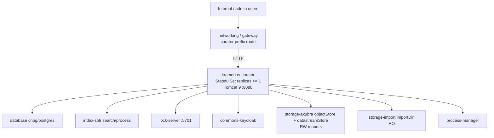

# Kramerius Curator

The `kramerius-curator` feature deploys the administrative Kramerius 7
instance. Unlike the public-facing deployment, the curator instance has
**read-write** access to the Akubra object and datastream stores. It is the
authoritative write path for all content administration operations: FOXML
editing, datastream management, access-control record updates, and the
submission of long-running batch processes (re-indexing, import pipelines,
migrations).

Starting from this chart version, the curator workload supports **multiple
replicas** (previously it was limited to one). Concurrent write safety is
ensured by the Hazelcast lock server: before mutating any digital object,
the curator acquires a distributed named lock and releases it on completion.
Pod anti-affinity rules prevent curator replicas from co-locating on the
same Kubernetes node.

## Position in the Stack



## Kubernetes Resources

| Resource | Name | Notes |
|---|---|---|
| StatefulSet | `kramerius-curator` | Replicas configurable, minimum 1 enforced by Helm validation |
| Service | `kramerius-curator` | ClusterIP, port 80 → container port 8080 |
| ServiceAccount | `kramerius-curator` | Bound to StatefulSet pods |
| ConfigMap | `kramerius-curator-config` | Generated `configuration.properties`, optional `server.xml` override |

## PVCs / Volumes

| Mount path in pod | Volume source | Access mode | Purpose |
|---|---|---|---|
| `/data/akubra/objectStore` | Akubra object store PVC | ReadWriteMany | Read and write FOXML objects |
| `/data/akubra/datastreamStore` | Akubra datastream store PVC | ReadWriteMany | Read and write binary datastreams |
| `/data/import/*` | Import store PVC(s) | ReadOnly | Inspect ingestion packages (writing handled by importer) |
| `/usr/local/tomcat/logs` | Tomcat logs PVC (see below) | ReadWriteMany | Persisted Tomcat / application logs |
| `/root/.kramerius4/javaagents/*` | javaagents shared PVC | ReadOnly | Optional Java agents, including OTEL |

### Tomcat logs volume

The Tomcat logs volume behaviour mirrors the public instance. Controlled by
`krameriusCurator.tomcatLogs.type`:

| `type` value | Behaviour |
|---|---|
| `pvc` | Chart creates a new PVC using `storageClass` and `size` |
| `nfs` | Chart creates a PVC backed by an NFS PersistentVolume using `nfsServer` + `nfsPath` |
| `existingClaim` | Chart binds to a pre-existing PVC named by `existingClaim` |

```yaml
krameriusCurator:
  tomcatLogs:
    type: pvc
    storageClass: nfs
    size: 5Gi
```

## Configuration

### Replica count and concurrency

Multiple curator replicas are fully supported. Helm enforces `replicas >= 1`.
Each replica acquires Hazelcast locks before performing write operations, so
concurrent writes from different replicas are safe.

```yaml
krameriusCurator:
  replicas: 2   # safe for concurrent write operations
```

When more than one replica is configured the chart automatically applies
`podAntiAffinity` rules
(`preferredDuringSchedulingIgnoredDuringExecution`, topology key
`kubernetes.io/hostname`) so that replicas land on different nodes.

### Image

```yaml
krameriusCurator:
  image:
    repository: ceskaexpedice/kramerius
    tag: "7.2.0"
    pullPolicy: Always
```

The curator and public instances share the same Docker image. The difference
in behaviour is driven entirely by the generated `configuration.properties`
(notably the import directory and write-enabled Akubra paths).

### JVM and Tomcat tuning

```yaml
krameriusCurator:
  catalinaOptsMemory: "-Xms4g -Xmx8g"
  env:
    TOMCAT_PASSWORD: "changeme"
```

Curator batch operations (re-indexing large collections, bulk FOXML
migrations) can be memory-intensive. For workloads processing collections
exceeding a million objects consider increasing `-Xmx` to 10–12 GiB and
adjusting the memory limit accordingly.

### Java agents and OTel

Multiple Java agents are supported identically to the public instance.
OTel settings are configured under `observability.otel.krameriusCurator`.
The final `CATALINA_OPTS` is assembled by the chart: `catalinaOptsMemory` +
javaagent flags + OTEL flags + `catalinaOptsExtra`.

```yaml
krameriusCurator:
  catalinaOptsExtra: "-Dcustom.curator.flag=true"
```

### Application configuration

`configuration.properties` for the curator is generated from the same set
of inputs as the public instance, plus the import directory path:

- CDK section from `cdk` (if enabled)
- Commons section from `krameriusCommon`
- Database section from `databases.*`
- Solr section from `solrConfig.*`
- Keycloak section from `auth.keycloak.*`
- Lock-server section from `hazelcast.*`
- Process Manager host (chart-computed)
- Akubra section from `akubraConfig.*` (if enabled)
- Import section from `storages.imports.*`
- Media section from `convert.*`
- Any additional lines from `configurationPropertiesExtra`

```yaml
krameriusCurator:
  serverXml: |
    # Optional full replacement for Tomcat server.xml.
    # (preferred key; config.serverXml kept for backward compatibility)
    <Server port="8005" shutdown="SHUTDOWN"></Server>
  config:
    configurationPropertiesExtra: |
      # Freeform key=value lines appended verbatim to configuration.properties
      import.thread.count=4
    serverXml: ""  # legacy location, still supported
```

### Probes

```yaml
krameriusCurator:
  livenessProbe:
    httpGet:
      path: /search/api/client/v7.0/info
      port: 8080
    initialDelaySeconds: 90
    periodSeconds: 30
    failureThreshold: 3
  readinessProbe:
    httpGet:
      path: /search/api/client/v7.0/info
      port: 8080
    initialDelaySeconds: 60
    periodSeconds: 15
```

### Environment variable summary

| Variable | Source | Purpose |
|---|---|---|
| `CATALINA_OPTS` | values/helpers | JVM heap, per-app javaagent flags, and optional OTEL flags |
| `TOMCAT_PASSWORD` | values | Tomcat Manager web UI password |
| `PROCESS_MANAGER_URL` | chart (auto) | HTTP URL of the process-manager service |
| `HAZELCAST_SERVER_ADDRESSES` | chart (auto) | `hazelcast.<namespace>.svc.cluster.local:5701` |
| `TZ` | chart | Timezone; defaults to `Europe/Prague` |

## Resource Requests / Limits

Curator resource defaults are lower than public because it typically runs
fewer replicas and traffic is driven by administrators rather than end users.
For heavy batch workloads the CPU limit should be raised.

| | Request | Limit |
|---|---|---|
| CPU | 250m | 1000m |
| Memory | 6Gi | 11Gi |

To override:

```yaml
krameriusCurator:
  resources:
    requests:
      cpu: "250m"
      memory: 6Gi
    limits:
      cpu: "1000m"
      memory: 11Gi
```

## Dependencies

| Component | Protocol | Purpose |
|---|---|---|
| `database` (cnpg) | PostgreSQL (TCP 5432) | Process queue, access control records, application state |
| `index-solr` | HTTP | Search index, processing index, monitoring |
| `lock-server` | Hazelcast TCP 5701 | Distributed locking for concurrent write coordination |
| `keycloak` | HTTP (OIDC) | Authentication and authorisation |
| `process-manager` | HTTP | Long-running batch process submission and monitoring |
| `storage-akubra` | PVC mount (RW) | Object and datastream binary storage — write path |
| `storage-import` | PVC mount (RO) | Staged ingest packages for import operations |
| `networking` / gateway | HTTP | Inbound request routing (curator-prefix routes) |

## Notes

- **Write authority.** The curator is the only Kramerius application instance
  that mounts Akubra stores with write permissions. All content mutations
  (object creation, datastream updates, FOXML edits, deletions) must go
  through the curator.
- **Lock server dependency.** Before scaling curator replicas, ensure the
  lock server is healthy and reachable. If the lock server pod is restarting
  during a scale-up, curator pods may fail to acquire locks and return errors
  for write operations.
- **Import directory.** The `/data/import/*` mounts are read-only in the curator pod.
  The `storage-import` feature owns the write path into the import store
  (typically via an external FTP/SFTP gateway or a Kubernetes Job). The
  curator reads staged packages from this location.
- **Anti-affinity.** When `replicas > 1`, the chart adds
  `podAntiAffinity` rules between curator pods automatically. If the cluster
  has fewer nodes than replicas, some pods will remain `Pending`; this is
  intentional to enforce the availability guarantee.
- `keycloak.json` is mounted from the `kramerius-keycloak` ConfigMap
  produced by `commons-keycloak`, identical to the public instance.
- Curator batch operations generate significant Solr write traffic. Monitor
  the processing Solr collection during large imports and consider isolating
  the processing collection from the search collection on separate Solr nodes.
