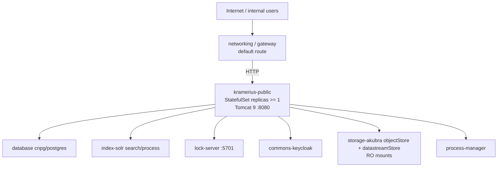

# Kramerius Public

The `kramerius-public` feature deploys the user-facing Kramerius 7 application
instance. It serves the public search API, IIIF image and presentation APIs,
the document viewer, and the OAI-PMH endpoint. All storage access is
read-only: this instance reads digital objects and datastreams from the shared
Akubra stores but never writes to them. Writes that do occur (session state,
process submissions, access logging) go exclusively to the PostgreSQL database
managed by the `database` feature.

The workload is designed for horizontal scaling. Replicas share the same
read-only Akubra mounts and connect to the same Solr, PostgreSQL, and
Hazelcast endpoints. Pod anti-affinity rules prevent two replicas from landing
on the same Kubernetes node, maximising availability during node maintenance.

## Position in the Stack



## Kubernetes Resources

| Resource | Name | Notes |
|---|---|---|
| StatefulSet | `kramerius-public` | Replicas configurable, minimum 1 enforced by Helm validation |
| Service | `kramerius-public` | ClusterIP, port 80 → container port 8080 |
| ServiceAccount | `kramerius-public` | Bound to StatefulSet pods |
| ConfigMap | `kramerius-public-config` | Generated `configuration.properties`, optional `server.xml` override |

## PVCs / Volumes

| Mount path in pod | Volume source | Access mode | Purpose |
|---|---|---|---|
| `/data/akubra/objectStore` | Akubra object store PVC | ReadOnly | Stores FOXML objects |
| `/data/akubra/datastreamStore` | Akubra datastream store PVC | ReadOnly | Stores binary datastreams |
| `/usr/local/tomcat/logs` | Tomcat logs PVC (see below) | ReadWriteMany | Persisted Tomcat / app logs |
| `/root/.kramerius4/javaagents/*` | javaagents shared PVC | ReadOnly | Optional Java agents, including OTEL |

### Tomcat logs volume

The Tomcat logs volume can be provisioned in three ways, controlled by
`krameriusPublic.tomcatLogs.type`:

| `type` value | Behaviour |
|---|---|
| `pvc` | Chart creates a new PVC using `storageClass` and `size` |
| `nfs` | Chart creates a PVC backed by an NFS `PersistentVolume` using `nfsServer` + `nfsPath` |
| `existingClaim` | Chart binds to a pre-existing PVC named by `existingClaim` |

```yaml
krameriusPublic:
  tomcatLogs:
    type: pvc           # or "nfs" / "existingClaim"
    storageClass: nfs
    size: 5Gi
    # For type: nfs:
    # nfsServer: "nas.example.com"
    # nfsPath: "/exports/kramerius/public/logs"
    # For type: existingClaim:
    # existingClaim: "my-existing-logs-pvc"
```

## Configuration

### Replica count

Helm enforces `replicas >= 1` with a `fail` guard. Setting `replicas: 0` will
cause `helm install` / `helm upgrade` to abort with an error.

```yaml
krameriusPublic:
  replicas: 2   # scale out for production
```

### Image

```yaml
krameriusPublic:
  image:
    repository: ceskaexpedice/kramerius
    tag: "7.2.0"
    pullPolicy: Always
```

Pin `tag` to an immutable digest in production environments to make
rollbacks predictable.

### JVM and Tomcat tuning

Base JVM memory flags are set via `catalinaOptsMemory`. Allocate at least
4 GiB heap for production workloads. The `TOMCAT_PASSWORD` env variable
sets the Tomcat Manager password; change the default before going to
production.

```yaml
krameriusPublic:
  catalinaOptsMemory: "-Xms4g -Xmx8g"
  env:
    TOMCAT_PASSWORD: "changeme"
```

### Java agents and OTel

Multiple Java agents are supported. OTel settings are configured under
`observability.otel.krameriusPublic`. The final `CATALINA_OPTS` is assembled
by the chart: `catalinaOptsMemory` + javaagent flags + OTEL flags + `catalinaOptsExtra`.

```yaml
krameriusPublic:
  catalinaOptsExtra: "-Dcustom.public.flag=true"
```

### application configuration

`configuration.properties` is generated from the union of:
- Solr endpoints from `solrConfig.*`
- Database section from `databases.*`
- Keycloak / auth settings from `auth.keycloak.*`
- Process Manager host (chart-computed)
- Lock-server section from `hazelcast.*`
- CDK section from `cdk` (if enabled)
- Commons section from `krameriusCommon`
- Akubra section from `akubraConfig.*` (if enabled)
- Import section from `storages.imports.*`
- Media section from `convert.*`
- Any additional lines from `configurationPropertiesExtra`

```yaml
krameriusPublic:
  serverXml: |
    # Optional full replacement for Tomcat server.xml.
    # (preferred key; config.serverXml kept for backward compatibility)
    <Server port="8005" shutdown="SHUTDOWN"></Server>
  config:
    configurationPropertiesExtra: |
      # Freeform key=value lines appended verbatim to configuration.properties
      some.custom.property=value
    serverXml: ""  # legacy location, still supported
```

### Probes

Liveness and readiness probes accept the standard Kubernetes probe object.
Leave empty to use the chart defaults (HTTP GET on `/search/api/client/v7.0/info`).

```yaml
krameriusPublic:
  livenessProbe:
    httpGet:
      path: /search/api/client/v7.0/info
      port: 8080
    initialDelaySeconds: 90
    periodSeconds: 30
    failureThreshold: 3
  readinessProbe:
    httpGet:
      path: /search/api/client/v7.0/info
      port: 8080
    initialDelaySeconds: 60
    periodSeconds: 15
```

### Environment variable summary

| Variable | Source | Purpose |
|---|---|---|
| `CATALINA_OPTS` | values/helpers | JVM heap, per-app javaagent flags, and optional OTEL flags |
| `TOMCAT_PASSWORD` | values | Tomcat Manager web UI password |
| `PROCESS_MANAGER_URL` | chart (auto) | HTTP URL of the process-manager service |
| `HAZELCAST_SERVER_ADDRESSES` | chart (auto) | `hazelcast.<namespace>.svc.cluster.local:5701` |
| `TZ` | chart | Timezone; defaults to `Europe/Prague` |

## Resource Requests / Limits

The memory limit must comfortably exceed the JVM `-Xmx` value to leave room
for Metaspace, thread stacks, and native libraries (typically +2–3 GiB over
`-Xmx`).

| | Request | Limit |
|---|---|---|
| CPU | 500m | 2000m |
| Memory | 6Gi | 11Gi |

To override:

```yaml
krameriusPublic:
  resources:
    requests:
      cpu: "500m"
      memory: 6Gi
    limits:
      cpu: "2000m"
      memory: 11Gi
```

## Dependencies

| Component | Protocol | Purpose |
|---|---|---|
| `database` (cnpg) | PostgreSQL (TCP 5432) | Session state, process submissions, access logs |
| `index-solr` | HTTP | Full-text search, processing index, monitoring |
| `lock-server` | Hazelcast TCP 5701 | Distributed locking for coordinated operations |
| `keycloak` | HTTP (OIDC) | Authentication and authorisation token validation |
| `process-manager` | HTTP | Process submission and status polling |
| `storage-akubra` | PVC mount (RO) | Object and datastream binary storage |
| `networking` / gateway | HTTP | Inbound request routing |

## Notes

- Akubra mounts are always `ReadOnly` for the public instance. The chart will
  not render a writable Akubra mount regardless of the storage feature
  configuration.
- Scaling beyond one replica requires a `ReadWriteMany`-capable storage class
  for the Tomcat logs volume (NFS or a compatible CSI driver). The default
  `storageClass: nfs` reflects this requirement.
- Pod anti-affinity is configurable via `krameriusPublic.affinity.type`
  (`hard`/`soft`) and defaults to `hard` in `values.yaml`.
- `keycloak.json` is mounted from the `kramerius-keycloak` ConfigMap produced
  by the `commons-keycloak` feature. Ensure that feature is enabled and
  configured before deploying the public instance.
- The IIIF image server workload (image-server / Cantaloupe) is a separate
  deployment. Kramerius Public delegates IIIF Image API tile serving to it;
  see the `storage-media` feature for details.
