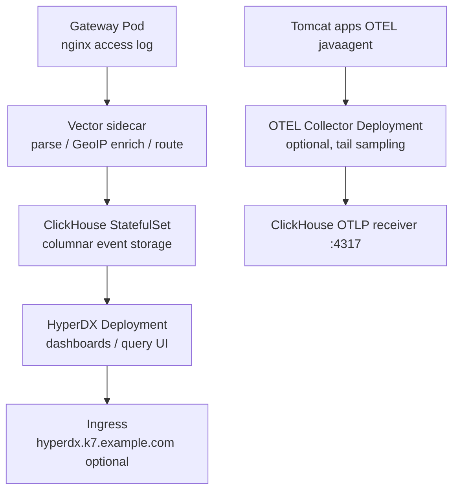
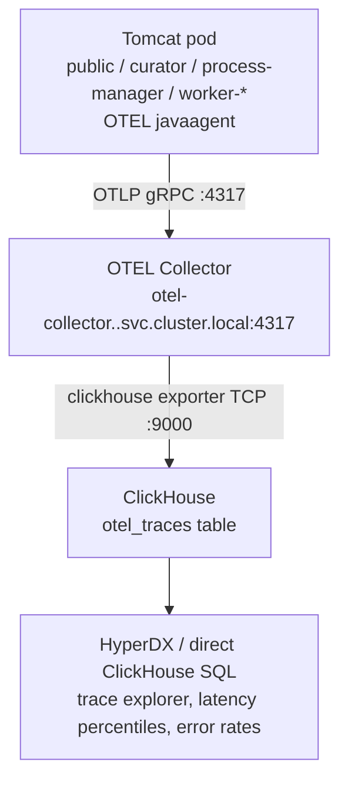

# Observability

Cross-cutting telemetry layer for logs, events, and analytics. Covers log
collection, aggregation, storage, and dashboarding for all runtime components
in the Kramerius stack.

**ELK (Elasticsearch / Kibana / in-chart Filebeat) has been removed from this chart.** Gateway and other workloads expose logs on **stdout**; **ClickStack** means the operational pipeline (typically **Vector → ClickHouse → HyperDX**, or your cluster equivalent) that ingests those logs. OTEL JVM traces can be routed through an in-cluster OTEL Collector (for tail sampling) or directly to ClickHouse.

## Position in the Stack

### ClickStack (Vector + ClickHouse + HyperDX)



## Kubernetes Resources

### ClickStack (Vector + ClickHouse + HyperDX)

| Resource | Name | Notes |
|---|---|---|
| StatefulSet | `clickhouse` | Columnar storage; partitioned tables |
| Deployment | `hyperdx` | Dashboard and query UI |
| Deployment | `otel-collector` | Optional OTLP trace processor and tail sampler |
| ConfigMap | `vector-config` | VRL transform pipeline |
| ConfigMap | `otel-collector-config` | Collector pipeline (generated or custom) |
| ConfigMap | `geoip-scripts` | `download-geoip.sh` used by init Job and updater CronJob |
| Service | `clickhouse` | ClusterIP HTTP (8123) and native (9000) ports |
| Service | `hyperdx` | ClusterIP port 8080 |
| Service | `otel-collector` | ClusterIP OTLP gRPC (4317), when collector enabled |
| PersistentVolumeClaim | `clickhouse-data` | Analytics event storage |
| Job | `geoip-init` | Hook (post-install only): downloads both MMDB files on first deploy |
| CronJob | `geoip-updater` | Monthly refresh of MMDB files (default: 5th at 04:00) |

## PVCs / Volumes

### ClickStack

| Mount path in pod | Volume source | Access mode | Purpose |
|---|---|---|---|
| `/var/lib/clickhouse` | PVC `clickhouse-data` | ReadWriteOnce | ClickHouse table data and WAL |
| `/var/lib/vector` | PVC `vector-data` | ReadWriteOnce | Vector disk buffer + GeoIP MMDB files (`geoip.mmdb`, `asn.mmdb`) |

These workloads are now templated behind `observability.enabled`. For production,
you can still choose operator-managed components, but this chart provides an
in-chart baseline deployment.

## Configuration

### ClickStack (Vector + ClickHouse + HyperDX)

The chart now renders baseline manifests for Vector + ClickHouse + HyperDX when
`observability.enabled=true`. `values.part.yaml` in this feature documents the
value structure used by those templates.

Key analytics dimensions targeted:
- Request rates (requests/second, windowed)
- HTTP status code distribution (2xx/3xx/4xx/5xx)
- HTTP method distribution
- Latency percentiles: p50, p95, p99
- Download volume (bytes sent) per endpoint
- Private vs. public IP classification (`is_private_ip`)
- Geographic enrichment: continent, country, city, organisation (`organization`)
- Referer and user-agent breakdowns
- SLA-style aggregations (error budget burn rate)

### GeoIP Enrichment

GeoIP enrichment is always active when `observability.enabled=true`. Two
[DB-IP free](https://db-ip.com/db/lite/ip-to-city) databases are downloaded
automatically at deploy time and refreshed on the 5th of every month:

| File | Source database | Fields populated |
|---|---|---|
| `/var/lib/vector/geoip.mmdb` | DB-IP City Lite | `continent_code`, `country_code`, `city_name` |
| `/var/lib/vector/asn.mmdb` | DB-IP ASN Lite | `organization` |

The `geoip-init` hook Job downloads both files on first install. The `geoip-updater` CronJob overwrites
them monthly. Private IPs skip the lookup entirely.

The `nginx_access_logs` ClickHouse table schema:

```sql
CREATE TABLE default.nginx_access_logs
(
    timestamp        DateTime64(3),
    remote_addr      String,
    is_private_ip    Bool                   DEFAULT false,
    request_method   LowCardinality(String),
    request_uri      String,
    path             String,
    query_params     String                 DEFAULT '',
    endpoint         LowCardinality(String) DEFAULT 'unknown',
    status           UInt16,
    body_bytes_sent  UInt64,
    response_time_ms UInt32,
    http_referer     String,
    http_user_agent  String,

    continent_code   LowCardinality(String) DEFAULT '',
    country_code     LowCardinality(String) DEFAULT '',
    city_name        String                 DEFAULT '',
    organization     String                 DEFAULT ''
)
ENGINE = MergeTree()
PARTITION BY toDate(timestamp)
ORDER BY (timestamp, status)
TTL toDateTime(timestamp) + INTERVAL <retentionDays> DAY;
```

Dashboards in HyperDX are greenfield for this migration.

### OpenTelemetry Distributed Tracing

OTEL tracing is configured under `observability.otel`. With
`observability.otel.collector.enabled=true`, agents export to the in-cluster
collector, which can apply tail sampling and then forward to ClickHouse.

#### Data flow



JVM agents always export to the OTEL Collector (`otel-collector.<namespace>.svc.cluster.local:4317`).
The collector writes to ClickHouse via the contrib `clickhouse` exporter (TCP 9000), which creates
the `otel_traces` table automatically.

#### Prerequisites

1. **javaagents PVC configured** — the `storages.javaagents` volume must be
   configured and contain the OTEL agent jar. Without it the OTEL jar cannot be
   mounted into Tomcat pods.

2. **OTEL javaagent JAR in the javaagents PVC** — copy the
   `opentelemetry-javaagent.jar` (or whichever filename you set as
   `observability.otel.jarName`) into the PVC before enabling any component.
   The jar is mounted as a separate file alongside any other javaagents already
   present in the PVC.

3. **Collector required** — enable `observability.otel.collector.enabled=true`.
   Without the collector there is no path from JVM agents to ClickHouse.

#### Configuration

```yaml
observability:
  otel:
    # JAR filename inside the javaagents PVC (must be pre-populated).
    jarName: opentelemetry-javaagent.jar

    # Transport: grpc (default) or http/protobuf
    protocol: grpc

    collector:
      enabled: true
      # Tail-sampling tuning
      decisionWait: 10s
      numTraces: 50000
      expectedNewTracesPerSec: 1000
      latencyThresholdMs: 1000
      probabilisticPercentage: 10

    # Enable per component. Service names are set automatically:
    #   otel.service.name  = component identifier (e.g. "kramerius-public")
    #   otel.service.instance.id = pod name (e.g. "kramerius-public-0")

    krameriusPublic:
      enabled: true
      # Restrict instrumentation to specific methods (optional).
      # Format: "fully.qualified.ClassName[method1,method2]"
      includeMethods: []

    krameriusCurator:
      enabled: true
      includeMethods: []

    processManager:
      enabled: false
      includeMethods: []

    # Worker groups: add an otel block per group entry in workerGroups.
    # Groups without an otel block fall back to workersDefault.
    workersDefault:
      enabled: false
      includeMethods: []
```

#### Service naming

Each enabled component is identified in traces by two resource attributes:

| Attribute | Value | Example |
|---|---|---|
| `service.name` | Fixed component label | `kramerius-public`, `worker-curator` |
| `service.instance.id` | Pod name (ordinal suffix) | `kramerius-public-0`, `worker-curator-1` |

These are set via `-Dotel.*` JVM flags injected into `CATALINA_OPTS` (or
`JAVA_OPTS` for process-manager) by the chart — no manual configuration is
needed.

#### Tail sampling

Tail sampling is implemented in the in-cluster OTEL Collector pipeline
(`tail_sampling` processor). The generated baseline policy keeps:
- error traces
- slow traces (latency threshold)
- probabilistic sample of the rest

You can override the entire collector config via `observability.otel.collector.config`.

#### Querying traces in ClickHouse

```sql
-- Recent slow spans for kramerius-public
SELECT
    service_name,
    span_name,
    attribute['http.url'] AS url,
    duration_ns / 1e6     AS duration_ms
FROM system.opentelemetry_span_log
WHERE service_name = 'kramerius-public'
  AND finish_date >= today() - 1
  AND duration_ns > 500000000   -- > 500 ms
ORDER BY finish_time_us DESC
LIMIT 50;

-- Error rate by component over the last hour
SELECT
    service_name,
    countIf(status_code = 2) AS errors,
    count()                  AS total,
    round(errors / total * 100, 2) AS error_pct
FROM system.opentelemetry_span_log
WHERE finish_date >= today()
  AND finish_time_us >= now() - INTERVAL 1 HOUR
GROUP BY service_name
ORDER BY error_pct DESC;
```

## Resource Requests / Limits

Size ClickHouse, Vector, and HyperDX per expected log and trace volume once those components are deployed. The gateway OpenResty pod defaults are documented in the `gateway` feature README.

## Dependencies

| Component | Protocol | Purpose |
|---|---|---|
| All pods (log sources) | stdout/stderr | Log collection input for Vector (or equivalent) |
| `networking` (Ingress) | HTTP/HTTPS | Optional exposure for HyperDX UI |
| Keycloak (optional) | HTTPS | Auth for HyperDX UI when integrated |

## Notes

- **ELK is removed** from this Helm chart; do not set `elk` values (the key no longer exists in `values.yaml`).
- Gateway nginx access logs are written to a shared in-memory volume (`/var/log/nginx/access.log`) and read by the Vector sidecar — they do **not** go to stdout.
- HyperDX is a self-hosted observability UI; authentication integration with Keycloak is optional and deployment-specific.
- To adjust the GeoIP refresh schedule set `observability.vector.geoip.updater.schedule` (cron expression, default `"0 4 5 * *"`).
- After a monthly MMDB refresh the new data only takes effect on the next pod restart (Vector caches MMDB files in memory at startup).
