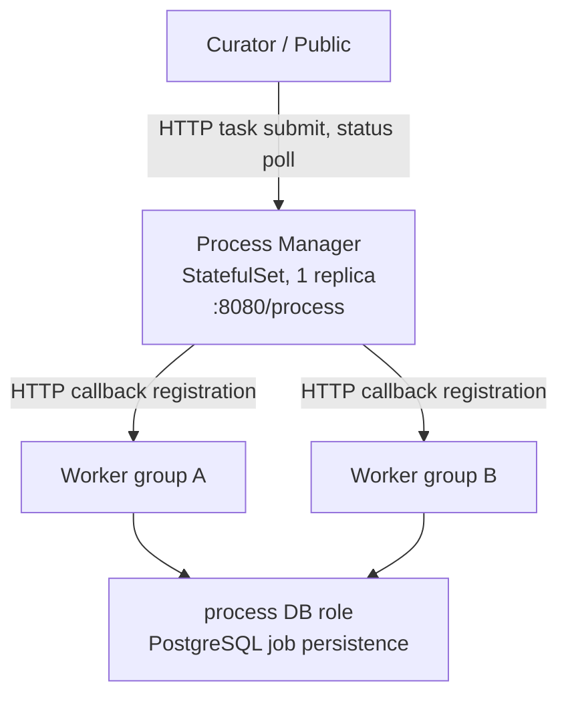

# Process Manager

Process Manager is the central task scheduler and dispatcher for Kramerius 7. It receives
asynchronous task requests from the curator and public application tiers, persists them in a
dedicated PostgreSQL database (provisioned by the `database` feature: CloudNative-PG or a chart-managed
PostgreSQL deployment, selected with `databases.mode`), and dispatches work to registered worker groups.
It exposes an HTTP API consumed both by the application tier (task submission) and by workers
(callback registration and result reporting).

Because Process Manager is stateful and acts as the single source of truth for in-flight jobs,
only **one replica is supported**. There is no multi-instance leadership election; running more
than one pod simultaneously will cause split-brain on the job queue.

## Position in the Stack



## Kubernetes Resources

| Resource | Name | Notes |
|---|---|---|
| StatefulSet | `process-manager` | 1 replica; must not be scaled out |
| Service (ClusterIP) | `process-manager` | Port 80 → 8080 |
| ConfigMap | `process-manager-config` | Optional `server.xml` override only |
| ServiceAccount | `process-manager` | Used by the pod for RBAC if required |

## PVCs / Volumes

| Mount path in pod | Volume source | Access mode | Purpose |
|---|---|---|---|
| `/usr/local/tomcat/logs` | `tomcat-logs` PVC (volumeClaimTemplates) | ReadWriteOnce | Tomcat access and catalina logs per pod |
| `/root/.kramerius4/javaagents/` | `javaagents` PVC (from `storages.javaagents`) | ReadOnlyMany | Shared JAR files for zero-to-many javaagents |

The `tomcat-logs` PVC is created per-pod via `volumeClaimTemplates` so each replica (even if
only one is in use) gets its own log volume. The `javaagents` volume is optional and mounted
when the component defines `javaagents` entries or OTEL injection is enabled.

## Configuration

### Database Connection

The StatefulSet always sets `JDBC_URL`, `JDBC_USERNAME`, and `JDBC_PASSWORD` from the chart:

- `JDBC_URL` is built by `kramerius.database.jdbcUrl` for role `process` (host, port, and database name come from `databases.process.jdbc` and mode-specific defaults).
- Credentials are read from the Secret named by `kramerius.database.secretName` for the same role (CNPG bootstrap secret or PG-mode secret, depending on `databases.mode`).

Any `JDBC_URL` / `JDBC_USERNAME` / `JDBC_PASSWORD` keys under `processManager.env` are **not** applied to the pod; configure the connection under `databases.process` instead (see `templates/database/README.md` and `templates/database/values.part.yaml`).

### configuration.properties

Process Manager does not use chart-generated `configuration.properties`.
Its runtime database wiring is provided via environment variables (`JDBC_URL`,
`JDBC_USERNAME`, `JDBC_PASSWORD`) and Kubernetes Secrets.

### server.xml Override

When `processManager.config.serverXml` is non-empty the value is rendered verbatim into a
`server.xml` key in the ConfigMap and mounted over the Tomcat default. Leave it empty to use
the image default.

```yaml
processManager:
  config:
    serverXml: |
      <?xml version="1.0" encoding="UTF-8"?>
      <Server port="8005" shutdown="SHUTDOWN">
        ...
      </Server>
```

### Liveness and Readiness Probes

Both probes default to empty (image defaults apply). Override them to set custom HTTP paths,
initial delay, or thresholds.

```yaml
processManager:
  livenessProbe:
    httpGet:
      path: /process/api/health
      port: 8080
    initialDelaySeconds: 60
    periodSeconds: 20
  readinessProbe:
    httpGet:
      path: /process/api/health
      port: 8080
    initialDelaySeconds: 30
    periodSeconds: 10
```

### Tomcat Logs PVC

```yaml
processManager:
  tomcatLogs:
    type: pvc            # always pvc for process-manager
    storageClass: nfs    # StorageClass that provisions the PVC
    size: 5Gi
    existingClaim: ""    # set to reuse an existing PVC instead of creating one
    nfsServer: ""        # used when StorageClass is 'nfs' with a manual PV
    nfsPath: ""
```

## Resource Requests / Limits

| | Request | Limit |
|---|---|---|
| CPU | 100m | 500m |
| Memory | 640Mi | 3Gi |

Memory limit must accommodate the JVM heap defined by `JAVA_OPTS` (`-Xmx2G` default) plus
off-heap overhead. Reduce `-Xmx` if you lower the memory limit.

```yaml
processManager:
  resources:
    requests:
      cpu: 100m
      memory: 640Mi
    limits:
      cpu: 500m
      memory: 3Gi
```

## Dependencies

| Component | Protocol | Purpose |
|---|---|---|
| `database` | JDBC/PostgreSQL | Job queue persistence; JDBC URL and Secret come from `databases.process` |
| `workers` | HTTP | Process Manager dispatches jobs and receives callbacks |
| `commons-tomcat` | config | Generates `CATALINA_OPTS`, optional javaagent wiring, logging config |
| `lock-server` | HTTP | Optional distributed lock coordination |
| Ingress (optional) | HTTPS | Exposes `/process` path for external tooling or admin access |

## Notes

- **Single replica only.** Process Manager has no leader election. Running 2+ pods will cause
  duplicate job dispatches and inconsistent state. The StatefulSet is intentionally constrained
  to `replicas: 1`.
- **JDBC env.** Do not rely on `processManager.env` for JDBC; the chart injects `JDBC_URL` and
  database credentials from the `database` feature for role `process`.
- **No process-manager configuration.properties.** Unlike public/curator/workers, Process Manager
  does not consume `configuration.properties` from this chart.
- **Worker callback URL pattern.** Workers register themselves using stable pod DNS:
  `http://<POD_NAME>.worker-<NAME>.<NAMESPACE>.svc.cluster.local:8080/worker/api/`. The headless
  Service for each worker group enables this addressing.
- **Javaagent support.** Zero-to-many javaagents are supported via per-component
  `javaagents` lists and the shared `javaagents` PVC. OTEL injection is controlled
  by `observability.otel.<component>.enabled` with `observability.otel.jarName`.
- **No Akubra or storage mounts.** Process Manager does not directly access object storage.
  All binary I/O happens inside worker pods.
