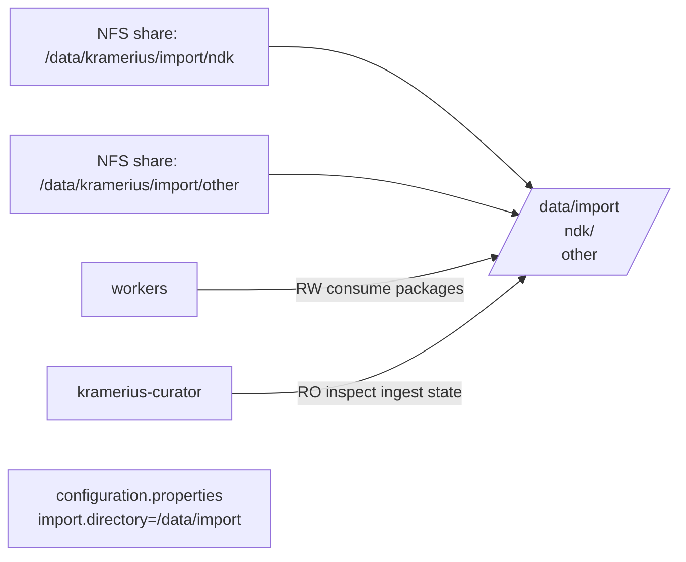

# Storage Import

Import storage defines the staging areas from which Kramerius workers ingest new digital objects. A single logical import root directory (`storages.imports.directory`) contains one or more named sub-volumes, each representing an independent NFS export or PVC. Workers mount these volumes read-write to consume and process packages; the curator mounts them read-only to inspect ingest state.

Multiple import volumes allow a single Kramerius deployment to serve content from separate providers or collections (for example, one NFS share per digitization partner) while keeping a unified ingest pipeline. The `storages.imports.directory` value is written into `configuration.properties` as `import.directory`.

## Position in the Stack



## Kubernetes Resources

One PV + PVC pair is created per entry in `storages.imports.volumes[]` when `type: nfs` and no `existingClaim` is set. When `type: pvc` without `existingClaim`, only a PVC is created.

| Resource | Name pattern | Notes |
|---|---|---|
| PersistentVolume | `<release>-import-<name>` | Per volume entry; `type: nfs` only |
| PersistentVolumeClaim | `<release>-import-<name>` | Per volume entry; `ReadWriteMany` |

Where `<name>` is the `name` field from the volume entry (e.g., `ndk` → `<release>-import-ndk`). The `name` field is truncated to 63 characters in resource names.

If `storages.imports.volumes` is empty, no import PVs or PVCs are created and no import volumes are mounted in any pod. This is valid for deployments that do not perform local ingestion.

## PVCs / Volumes

| Mount path in pod | Volume source | Access mode | Curator | Workers | Purpose |
|---|---|---|---|---|---|
| `<volume.mountPath>` | NFS or PVC per entry | ReadWriteMany | Read-only | Read-write | Ingest staging area |

The `mountPath` for each volume must be under `storages.imports.directory`. A typical layout:

```
storages.imports.directory = /data/import
  volumes[0].mountPath     = /data/import/ndk
  volumes[1].mountPath     = /data/import/partner2
```

Curator receives all import volumes with `readOnly: true`. Workers receive all import volumes with `readOnly: false`.

## Configuration

### Root import directory

The `imports.directory` value is injected into `configuration.properties` as `import.directory`. All worker processes use this path as the root when scanning for ingest packages.

```yaml
storages:
  imports:
    directory: /data/import
```

### Import volumes list

Each entry in `imports.volumes` defines one independently mounted staging volume. The `name` field is used in PV/PVC resource names; the `mountPath` determines where the volume appears inside the pod.

```yaml
storages:
  imports:
    directory: /data/import
    volumes:
      - name: ndk
        mountPath: /data/import/ndk
        type: nfs
        nfsServer: ""          # Empty uses storages.defaultNfsServer
        nfsPath: /data/kramerius/import/ndk
        existingClaim: ""
        storageClass: nfs
        size: 50Gi
        mountOptions:
          - hard
          - nfsvers=4.1

      - name: partner2
        mountPath: /data/import/partner2
        type: nfs
        nfsServer: "10.0.2.20"
        nfsPath: /export/kramerius/import/partner2
        existingClaim: ""
        storageClass: nfs
        size: 100Gi
        mountOptions: []
```

### Using an existing claim

To attach a pre-provisioned PVC without creating PV/PVC resources from this chart:

```yaml
storages:
  imports:
    volumes:
      - name: archive
        mountPath: /data/import/archive
        type: pvc
        existingClaim: my-archive-import-pvc
        size: 200Gi            # Informational only when existingClaim is set
```

### Volume backend types

| `type` | PV created? | PVC created? | Notes |
|---|---|---|---|
| `nfs` + no `existingClaim` | Yes | Yes | Chart creates static PV + PVC bound by name |
| `nfs` + `existingClaim` set | No | No | Existing claim used directly |
| `pvc` + no `existingClaim` | No | Yes | Dynamic provisioning via `storageClass` |
| `pvc` + `existingClaim` set | No | No | Existing claim used directly |

### Empty volumes list

When `storages.imports.volumes` is empty (`volumes: []`), no import resources are created. Workers and curator still start, but no import paths are mounted and `import.directory` in `configuration.properties` reflects only the root directory value.

## Resource Requests / Limits

Import storage volumes carry no standalone compute resources — there are no Pods or containers in this feature. Storage sizing depends on the volume and rate of ingest packages.

| Consideration | Guidance |
|---|---|
| Capacity per volume | Size to hold a full batch of unprocessed packages; workers do not automatically clean up source files |
| Throughput | NFS throughput matters most for large binary ingest (images, PDF); use `nfsvers=4.1` with `hard` mounts |
| Worker IOPS | Workers perform sequential reads of large files; sustained read bandwidth is more important than random IOPS |

## Dependencies

| Component | How |
|---|---|
| `workers` | Mount all import volumes read-write; consume and process ingest packages |
| `kramerius-curator` | Mounts all import volumes read-only; used for ingest inspection and coordination |
| NFS server(s) | External dependency per volume; must be reachable from all pod nodes before workloads start |

## Notes

- Each `mountPath` must be a subdirectory of `storages.imports.directory`. This is validated at template render time; Helm rendering fails if any mount path is outside the configured root.
- Volume `name` values must be unique within the `volumes` list. Duplicate names produce duplicate PVC names and will cause apply errors.
- The PV `persistentVolumeReclaimPolicy` is `Retain`. Deleting the chart does not delete the backing NFS data or the PVs.
- `storages.defaultNfsServer` is used as a fallback for any import volume with an empty `nfsServer` field, the same as other NFS-backed storages in this chart.
- Ingest cleanup (removing processed packages from the import mount) is the responsibility of the worker processes or an external cleanup job. The chart does not manage this lifecycle.
- Adding a new volume entry to a running deployment requires a rolling restart of curator and all worker StatefulSets so the new mount is injected. Helm upgrade handles this automatically via the pod checksum annotation.
