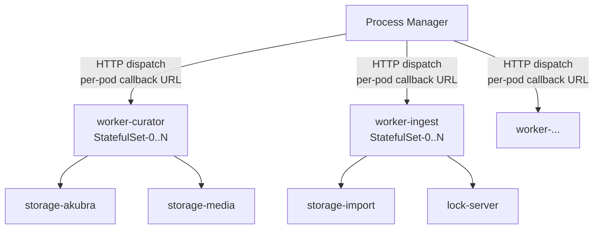

# Workers

Workers are the background task execution units of Kramerius 7. Each logical worker group maps
to an independent Kubernetes StatefulSet. Groups run in parallel, can each accept different
process profile subsets, and are individually scalable. Workers pull jobs by registering their
stable per-pod DNS address with Process Manager; Process Manager then calls back into each pod
to dispatch individual tasks.

Workers have no direct database connection. All persistent state (job status, queue) lives in
Process Manager. Workers communicate exclusively via the Process Manager HTTP API.

## Position in the Stack



## Kubernetes Resources

One set of resources is created **per worker group** defined in `workerGroups`:

| Resource | Name pattern | Notes |
|---|---|---|
| StatefulSet | `worker-<name>` | Headless; `replicas` from group config |
| Service (headless) | `worker-<name>` | `clusterIP: None`; enables stable per-pod DNS |
| ServiceAccount | `worker-<name>` | Dedicated per group |
| ConfigMap | `worker-<name>-config` | Rendered `configuration.properties`, `mail.properties`, `server.xml`, `lp.xml` |

The headless Service is critical: it gives each pod the DNS name
`<pod>.<svc>.<namespace>.svc.cluster.local` that workers advertise back to Process Manager
for dispatch callbacks.

## PVCs / Volumes

| Mount path in pod | Volume source | Access mode | Purpose |
|---|---|---|---|
| `/usr/local/tomcat/logs` | `tomcat-logs-<name>` (volumeClaimTemplates) | ReadWriteOnce | Per-pod Tomcat and Catalina logs |
| `/root/.processplatform` | `process-logs` PVC (`workersDefaults.processLogs`) | ReadWriteMany | Shared process platform log output across all worker groups |
| `/root/.kramerius4/mail.properties` | `worker-<name>-config` key `mail.properties` | ReadOnly | Worker mail transport configuration |
| `/root/.kramerius4/javaagents/` | `javaagents` PVC (from `storages.javaagents`) | ReadOnlyMany | Shared javaagent JARs; zero-to-many per group |
| `/data/akubra/objectStore` | Akubra object store PVC | ReadWriteMany | Object storage (when process types require it) |
| `/data/akubra/datastreamStore` | Akubra datastream PVC | ReadWriteMany | Datastream storage |
| `/data/imageserver` | imageserver media PVC | ReadWriteMany | Image derivatives |
| `/data/audioserver` | audioserver media PVC | ReadWriteMany | Audio derivatives |
| `/data/pdfserver` | pdfserver media PVC | ReadWriteMany | PDF derivatives |
| `/data/import/*` | import PVC(s) | ReadWriteMany | Source ingest directories; multiple import volumes supported |

The `tomcat-logs` PVC is per-pod via `volumeClaimTemplates`. All other volumes are shared across
group replicas. The `process-logs` PVC (`workersDefaults.processLogs`) is shared across **all** worker
groups; each pod writes to its own subdirectory under `/root/.processplatform`.

## Configuration

### Worker Groups

Each entry in `workerGroups` produces a full set of Kubernetes resources. The minimum viable
group only requires `name` and `replicas`.

```yaml
workerGroups:
  - name: curator
    replicas: 1
    workerLoopSleepSecs: 10
    workerLoopPrintSecs: 30
    env:
      CATALINA_OPTS: "-Xms512M -Xmx2G"
    resources:
      requests:
        cpu: 250m
        memory: 640Mi
      limits:
        cpu: 1500m
        memory: 3Gi
```

### Image Override per Group

By default all groups use `workersDefaults.image`. Override per group with:

```yaml
workerGroups:
  - name: ingest
    replicas: 2
    image:
      repository: ceskaexpedice/curator-worker
      tag: "7.2.0"
      pullPolicy: Always
```

### Profile Subset

`profilesSubset` restricts which process types a group will accept. Leave it empty (or unset)
to accept all types. Use comma-separated profile names to limit a group.

```yaml
workerGroups:
  - name: ingest
    replicas: 2
    profilesSubset: "import,new_indexer_index_object"
```

This is the primary mechanism for workload specialisation: dedicate one group to heavy import
jobs and another to fast re-index tasks.

### Javaagent and OTel

Each group supports zero-to-many javaagents via the commons-tomcat helpers. The JAR is sourced
from the shared `javaagents` PVC. OpenTelemetry settings are taken from
`observability.otel.workersDefault` (with optional per-group `otel` override).

The final `CATALINA_OPTS` is assembled by the chart: `catalinaOptsMemory` +
javaagent flags + OTEL flags + `catalinaOptsExtra`.

```yaml
workerGroups:
  - name: curator
    catalinaOptsMemory: "-Xms1G -Xmx4G"
    catalinaOptsExtra: "-Dcustom.worker.flag=true"
```

### Configuration Properties Extra

Append arbitrary `key=value` lines to the rendered `configuration.properties` ConfigMap entry.

```yaml
workerGroups:
  - name: curator
    config:
      configurationPropertiesExtra: |
        some.custom.flag=true
```

### Worker-specific configuration.properties map

Use `workersDefaults.configuration` for shared worker-only keys,
and `workerGroups[].configuration` to override/extend by group.
Both are key-value maps (not raw string blocks).

### mail.properties

Define default mail settings in `workersDefaults.mail` and optionally
override per group with `workerGroups[].mail`. The resulting file is mounted
at `/root/.kramerius4/mail.properties`. Values are key-value maps (not raw string blocks).

### server.xml and lp.xml Overrides

Both `serverXml` and `lpXml` under each group's `config` are mounted verbatim when non-empty.
If group values are empty, `workersDefaults.config.serverXml` and `workersDefaults.config.lpXml` are used as defaults.
`lpXml` configures the Logs Platform XML descriptor specific to Kramerius process logging.

```yaml
workerGroups:
  - name: curator
    config:
      serverXml: ""    # leave empty to use image default
      lpXml: ""        # leave empty to use image default
```

### Shared Tomcat Logs PVC

All worker StatefulSets share the same PVC configuration object (`workersDefaults.tomcatLogs`) but each
StatefulSet creates its **own** `volumeClaimTemplates` entry, so PVC names are scoped per group.

```yaml
workersDefaults:
  tomcatLogs:
    type: pvc
    storageClass: nfs
    size: 5Gi
    existingClaim: ""
    nfsServer: ""
    nfsPath: ""
```

### Process Logs PVC

The `workersDefaults.processLogs` PVC is a single shared volume mounted at `/root/.processplatform` in
every worker pod across all groups. Pods are expected to write to subdirectories named after
the pod name to avoid collisions.

```yaml
workersDefaults:
  processLogs:
    type: pvc
    storageClass: nfs
    size: 5Gi
    existingClaim: ""
    nfsServer: ""
    nfsPath: ""
```

## Resource Requests / Limits

Defined per group. Defaults apply when `resources` is omitted from a group entry.

| | Request | Limit |
|---|---|---|
| CPU | 250m | 1500m |
| Memory | 640Mi | 3Gi |

Adjust memory limit in tandem with `CATALINA_OPTS` `-Xmx`. Import-heavy groups may require
larger CPU limits during peak ingest.

## Dependencies

| Component | Protocol | Purpose |
|---|---|---|
| `process-manager` | HTTP | Job dispatch and callback; workers register their pod URL |
| `lock-server` | HTTP | Distributed lock for operations that must not run concurrently |
| `storage-akubra` | filesystem (PVC) | Object and datastream storage access |
| `storage-import` | filesystem (PVC) | Source material for ingest processes |
| `storage-media` | filesystem (PVC) | Image/audio/PDF derivative storage |
| `commons-tomcat` | config | `CATALINA_OPTS`, javaagent wiring, logging ConfigMap |
| `keycloak` | config | Keycloak section in worker `configuration.properties` |

## Notes

- **No database connection.** Workers intentionally have no JDBC wiring. All job state is owned
  by Process Manager.
- **Headless Service is mandatory.** Without a headless Service the stable per-pod DNS name
  (`<pod>.<svc>.<ns>.svc.cluster.local`) is not resolvable. Process Manager uses this address
  for dispatch callbacks. Removing or patching the headless Service will break job delivery.
- **WORKER_BASE_URL is auto-generated.** The Helm template derives each pod's callback URL from
  the pod name and the headless Service DNS, so you do not set it manually.
- **Multiple import volumes.** The chart supports mounting more than one import PVC per worker
  group. Each import volume maps to a distinct path under `/data/import/*`.
- **Profile subsets and replicas are independent knobs.** You can have a single-replica group
  for serial imports and a 3-replica group for parallel re-indexing, each with different profile
  subsets, using the same worker image.
- **processLogs PVC is shared across groups.** Ensure the `storageClass` supports
  `ReadWriteMany`. With NFS this is straightforward; with block storage a different access mode
  strategy is needed.
- **OTel in CATALINA_OPTS.** OTel JVM flags are appended via observability settings when enabled,
  and merged into worker `CATALINA_OPTS`.
